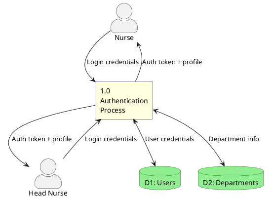

# DFD - Authentication Process

```plantuml
@startuml
!define RECTANGLE class

skinparam actorStyle awesome
skinparam rectangle {
    BackgroundColor LightYellow
    BorderColor DarkBlue
}
skinparam database {
    BackgroundColor LightGreen
    BorderColor DarkGreen
}

actor "Nurse" as Nurse
actor "Head Nurse" as HeadNurse

rectangle "1.0\nAuthentication\nProcess" as Auth

database "D1: Users" as D1
database "D2: Departments" as D2

' Authentication flows
Nurse --> Auth : Login credentials
HeadNurse --> Auth : Login credentials
Auth --> Nurse : Auth token + profile
Auth --> HeadNurse : Auth token + profile
Auth <--> D1 : User credentials
Auth <--> D2 : Department info

@enduml
```

## Description
Authentication process handles user login and session management for both Nurses and Head Nurses.
