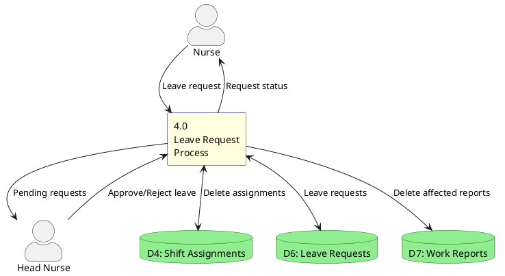

# DFD - Leave Request Process

## Description
Leave request process handles nurse leave requests and Head Nurse approval workflow. Approved leaves automatically delete affected shift assignments and reports.
