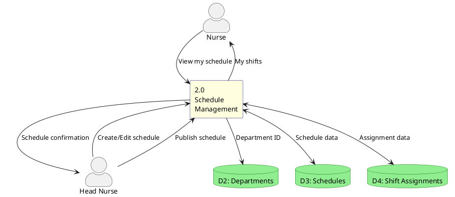

# DFD - Schedule Management

```plantuml
@startuml
!define RECTANGLE class

skinparam actorStyle awesome
skinparam rectangle {
    BackgroundColor LightYellow
    BorderColor DarkBlue
}
skinparam database {
    BackgroundColor LightGreen
    BorderColor DarkGreen
}

actor "Nurse" as Nurse
actor "Head Nurse" as HeadNurse

rectangle "2.0\nSchedule\nManagement" as Schedule

database "D2: Departments" as D2
database "D3: Schedules" as D3
database "D4: Shift Assignments" as D4

' Schedule Management flows
HeadNurse --> Schedule : Create/Edit schedule
HeadNurse --> Schedule : Publish schedule
Nurse --> Schedule : View my schedule
Schedule --> HeadNurse : Schedule confirmation
Schedule --> Nurse : My shifts
Schedule <--> D3 : Schedule data
Schedule <--> D4 : Assignment data
Schedule --> D2 : Department ID

@enduml
```

## Description
Schedule management allows Head Nurses to create and publish schedules, and Nurses to view their assigned shifts.
