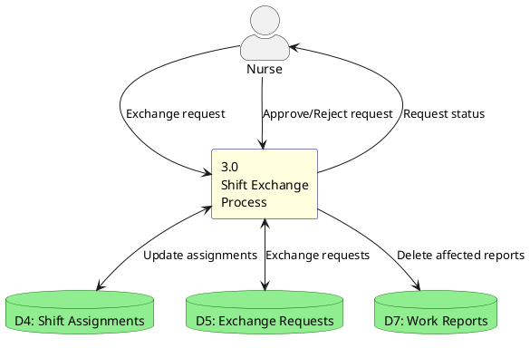

# DFD - Shift Exchange Process

```plantuml
@startuml
!define RECTANGLE class

skinparam actorStyle awesome
skinparam rectangle {
    BackgroundColor LightYellow
    BorderColor DarkBlue
}
skinparam database {
    BackgroundColor LightGreen
    BorderColor DarkGreen
}

actor "Nurse" as Nurse

rectangle "3.0\nShift Exchange\nProcess" as Exchange

database "D4: Shift Assignments" as D4
database "D5: Exchange Requests" as D5
database "D7: Work Reports" as D7

' Shift Exchange flows
Nurse --> Exchange : Exchange request
Nurse --> Exchange : Approve/Reject request
Exchange --> Nurse : Request status
Exchange <--> D5 : Exchange requests
Exchange <--> D4 : Update assignments
Exchange --> D7 : Delete affected reports

@enduml
```

## Description
Shift exchange process allows nurses to request shift swaps with other nurses and approve/reject incoming requests.
