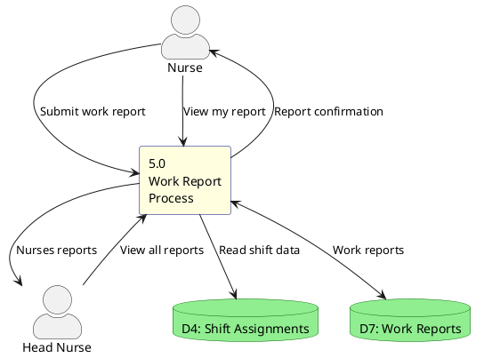

# DFD - Work Report Process

## Description
Work report process allows nurses to generate and submit monthly work reports based on their shift assignments. Head Nurses can view all reports from their department.
