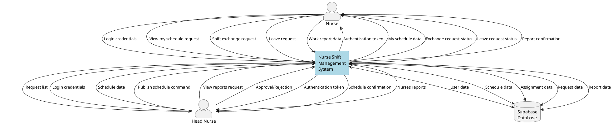
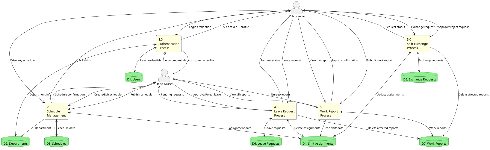

# Data Flow Diagram - Nurse Shift Management System

## DFD Level 0 - Context Diagram



## DFD Level 1 - Major Processes



## Process Descriptions

### Level 0 - Context Diagram
Shows external entities (Nurse, Head Nurse, Database) interacting with the system

### Level 1 - Major Processes

| Process | Name | Description |
|---------|------|-------------|
| **1.0** | Authentication Process | Handles user login, registration and session management |
| **2.0** | Schedule Management | Handles schedule creation, editing, publishing and viewing |
| **3.0** | Shift Exchange Process | Handles shift exchange requests and approvals between nurses |
| **4.0** | Leave Request Process | Handles leave requests and approval workflow |
| **5.0** | Work Report Process | Handles work report generation and submission |

## Data Stores

| Data Store | Name | Columns |
|------------|------|---------|
| **D1** | Users | user_id, name, email, password, role, phone, department_id |
| **D2** | Departments | department_id, department_name, head_nurse_id |
| **D3** | Schedules | schedules_id, date, shift_type, status, required_nurse, department_id |
| **D4** | Shift Assignments | assignment_id, user_id, schedules_id, assigned_by, assigned_date |
| **D5** | Exchange Requests | exchange_id, requester_id, target_user_id, original_schedule_id, target_schedule_id, status |
| **D6** | Leave Requests | leave_id, user_id, start_date, end_date, leave_type, reason, status |
| **D7** | Work Reports | work_report_id, user_id, report_month, work_days_count, shifts_count, total_hours |

## How to Generate Diagrams

### Generate diagram online:
1. Visit **[PlantUML Online Editor](https://www.plantuml.com/plantuml/uml/)**
2. Copy the PlantUML code between `@startuml` and `@enduml`
3. Paste into the editor
4. Diagram will automatically render
5. You can download as PNG, SVG or PDF format

### Alternative online tools:
- **PlantText**: https://www.planttext.com/
- **PlantUML QEditor**: https://plantuml-editor.kkeisuke.com/
- **Gravizo**: http://www.gravizo.com/

### Install PlantUML locally:
```bash
# Requires Java installed
npm install -g node-plantuml
# Or
brew install plantuml  # For macOS
```
