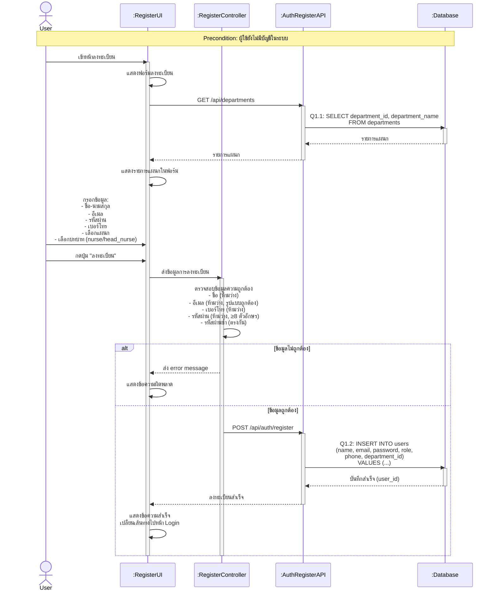

# Sequence Diagram 1 - User Registration (ลงทะเบียนผู้ใช้)

```mermaid
sequenceDiagram
    actor User
    participant UI as :RegisterUI
    participant Controller as :RegisterController
    participant API as :AuthRegisterAPI
    participant DB as :Database

    Note over User,DB: Precondition: ผู้ใช้ยังไม่มีบัญชีในระบบ

    User->>UI: เข้าหน้าลงทะเบียน
    activate UI
    UI->>UI: แสดงฟอร์มลงทะเบียน

    UI->>API: GET /api/departments
    activate API
    API->>DB: Q1.1: SELECT department_id, department_name<br/>FROM departments
    activate DB
    DB-->>API: รายการแผนก
    deactivate DB
    API-->>UI: รายการแผนก
    deactivate API
    UI->>UI: แสดงรายการแผนกในฟอร์ม

    User->>UI: กรอกข้อมูล:<br/>- ชื่อ-นามสกุล<br/>- อีเมล<br/>- รหัสผ่าน<br/>- เบอร์โทร<br/>- เลือกแผนก<br/>- เลือกบทบาท (nurse/head_nurse)

    User->>UI: กดปุ่ม "ลงทะเบียน"
    UI->>Controller: ส่งข้อมูลการลงทะเบียน
    activate Controller

    Controller->>Controller: ตรวจสอบข้อมูลความถูกต้อง<br/>- ชื่อ (ห้ามว่าง)<br/>- อีเมล (ห้ามว่าง, รูปแบบถูกต้อง)<br/>- เบอร์โทร (ห้ามว่าง)<br/>- รหัสผ่าน (ห้ามว่าง, ≥8 ตัวอักษร)<br/>- รหัสผ่านซ้ำ (ตรงกัน)

    alt ข้อมูลไม่ถูกต้อง
        Controller-->>UI: ส่ง error message
        UI->>UI: แสดงข้อความผิดพลาด
    else ข้อมูลถูกต้อง
        Controller->>API: POST /api/auth/register
        activate API
        API->>DB: Q1.2: INSERT INTO users<br/>(name, email, password, role,<br/>phone, department_id)<br/>VALUES (...)
        activate DB
        DB-->>API: บันทึกสำเร็จ (user_id)
        deactivate DB
        API-->>UI: ลงทะเบียนสำเร็จ
        deactivate API
        UI->>UI: แสดงข้อความสำเร็จ<br/>เปลี่ยนเส้นทางไปหน้า Login
    end

    deactivate Controller
    deactivate UI
```