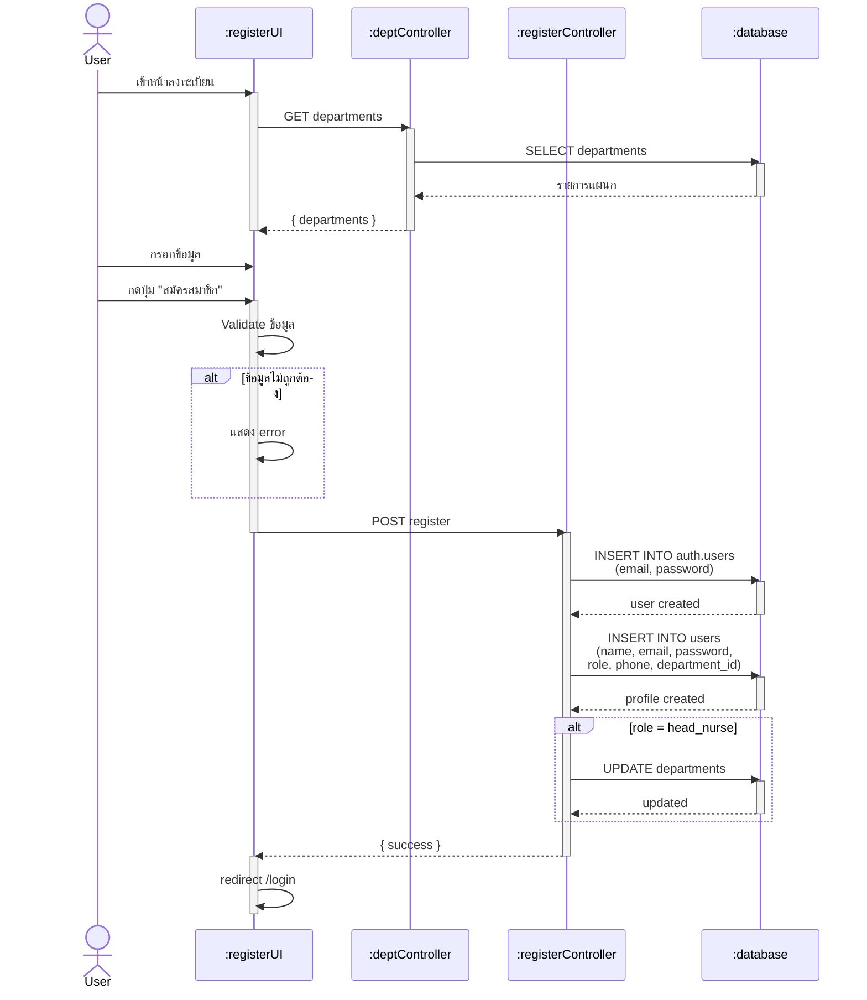

# Sequence Diagram: Use Case 1 - Register (ลงทะเบียนผู้ใช้)

```mermaid
sequenceDiagram
    actor User
    participant UI as :registerUI
    participant DeptCtrl as :deptController
    participant RegCtrl as :registerController
    participant DB as :database

    User->>UI: เข้าหน้าลงทะเบียน
    activate UI
    UI->>DeptCtrl: GET departments
    activate DeptCtrl
    DeptCtrl->>DB: SELECT departments
    activate DB
    DB-->>DeptCtrl: รายการแผนก
    deactivate DB
    DeptCtrl-->>UI: { departments }
    deactivate DeptCtrl
    deactivate UI

    User->>UI: กรอกข้อมูล
    User->>UI: กดปุ่ม "สมัครสมาชิก"

    activate UI
    UI->>UI: Validate ข้อมูล

    alt ข้อมูลไม่ถูกต้อง
        UI->>UI: แสดง error
    end

    UI->>RegCtrl: POST register
    deactivate UI
    activate RegCtrl
    RegCtrl->>DB: INSERT INTO auth.users<br/>(email, password)
    activate DB
    DB-->>RegCtrl: user created
    deactivate DB

    RegCtrl->>DB: INSERT INTO users<br/>(name, email, password,<br/>role, phone, department_id)
    activate DB
    DB-->>RegCtrl: profile created
    deactivate DB

    alt role = head_nurse
        RegCtrl->>DB: UPDATE departments
        activate DB
        DB-->>RegCtrl: updated
        deactivate DB
    end

    RegCtrl-->>UI: { success }
    deactivate RegCtrl
    activate UI
    UI->>UI: redirect /login
    deactivate UI
```
