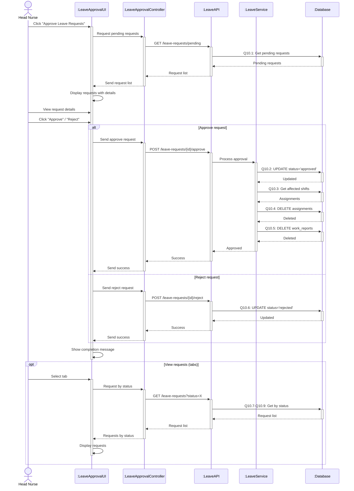

# Sequence Diagram 10 - Approve Leave Request (Head Nurse)

## Layer Description

| Layer | Name | Responsibility |
|-------|------|----------------|
| **Actor** | Head Nurse | Approve/reject leave requests |
| **UI** | :LeaveApprovalUI | Leave approval page |
| **Controller** | :LeaveApprovalController | Control leave approval |
| **API** | :LeaveAPI | API Endpoint `/api/leave-requests` |
| **Service** | :LeaveService | Process approval/rejection |
| **Database** | :Database | Supabase database |

## Main Steps

1. **View requests** - Get pending requests (Q10.1)
2. **Approve** - Delete affected shifts (Q10.2-Q10.5)
3. **Reject** - Update status to rejected (Q10.6)
4. **Track** - View requests by tab (Q10.7-Q10.9)
