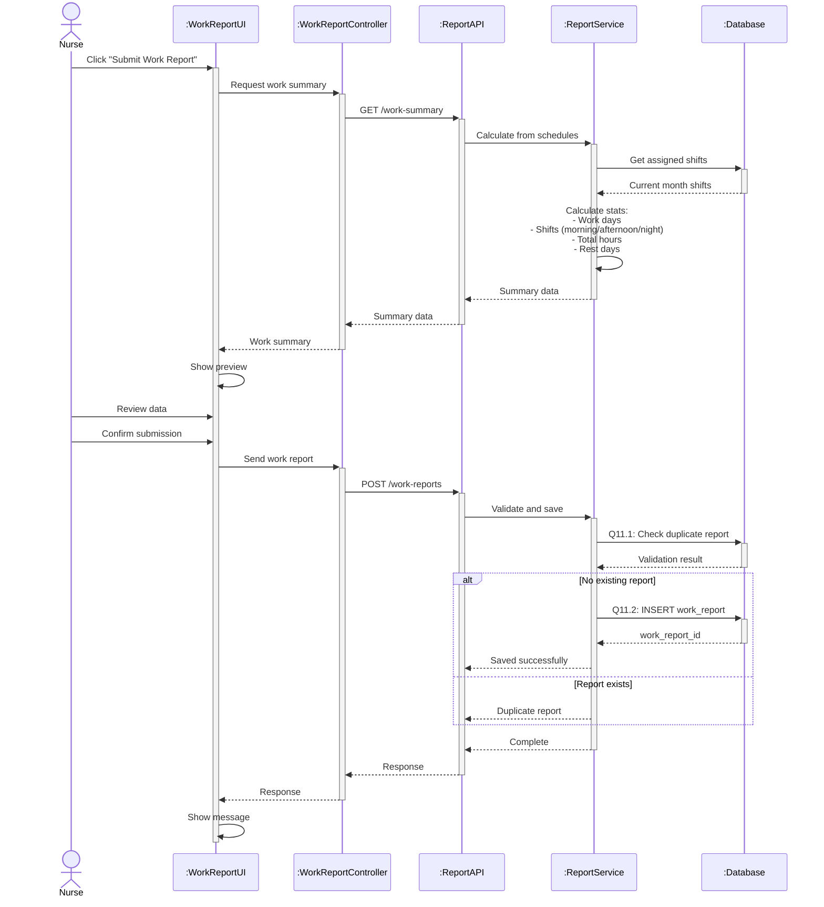

# Sequence Diagram 11 - Submit Work Report (Nurse)

## Layer Description

| Layer | Name | Responsibility |
|-------|------|----------------|
| **Actor** | Nurse | Submit work report |
| **UI** | :WorkReportUI | Work report page |
| **Controller** | :WorkReportController | Control report submission |
| **API** | :ReportAPI | API Endpoint `/api/work-reports` |
| **Service** | :ReportService | Calculate and save report |
| **Database** | :Database | Supabase database |

## Main Steps

1. **Calculate summary** - Get shifts and calculate stats
2. **Show preview** - Display summary for review
3. **Submit** - Check duplicate and save (Q11.1-Q11.2)
