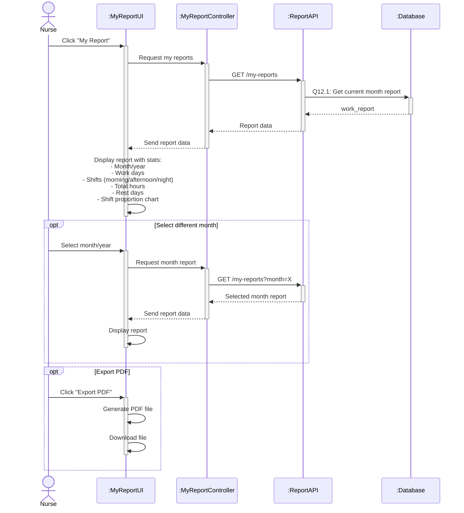

# Sequence Diagram 12 - View My Report (Nurse)

## Layer Description

| Layer | Name | Responsibility |
|-------|------|----------------|
| **Actor** | Nurse | View own work report |
| **UI** | :MyReportUI | My report page |
| **Controller** | :MyReportController | Control report viewing |
| **API** | :ReportAPI | API Endpoint `/api/my-reports` |
| **Database** | :Database | Supabase database |

## Main Steps

1. **View report** - Get and display current month report (Q12.1)
2. **Select month** - View different month reports
3. **Export PDF** - Generate and download report
