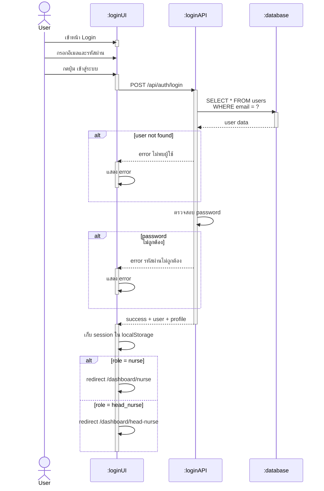

# Sequence Diagram: Use Case 2 - Login (เข้าสู่ระบบ)

## Layer Architecture

| Layer | Component | Technology |
|-------|-----------|------------|
| User | ผู้ใช้งาน | Browser |
| :loginUI | UI Layer | Next.js Client Component |
| :loginAPI | API Layer | /api/auth/login |
| :database | Database | PostgreSQL (Supabase) |

## Key Points

### Authentication Flow
- ตรวจสอบ email จาก users table
- เปรียบเทียบ password แบบ plaintext
- สร้าง session token (base64)
- เก็บ user + profile ใน localStorage

### Error Handling
- ไม่พบ user → error "ไม่พบข้อมูลผู้ใช้"
- password ไม่ถูกต้อง → error "รหัสผ่านไม่ถูกต้อง"

### Role-based Redirect
- nurse → /dashboard/nurse
- head_nurse → /dashboard/head-nurse

## API Endpoints

**POST /api/auth/login**
- รับ: { email, password }
- ตรวจสอบ credentials จาก users table
- คืนค่า: { success, user, profile }

## Database Tables

**users** - user profile และ authentication
- Query: `SELECT * FROM users WHERE email = ?`
- เปรียบเทียบ: `password === inputPassword`
