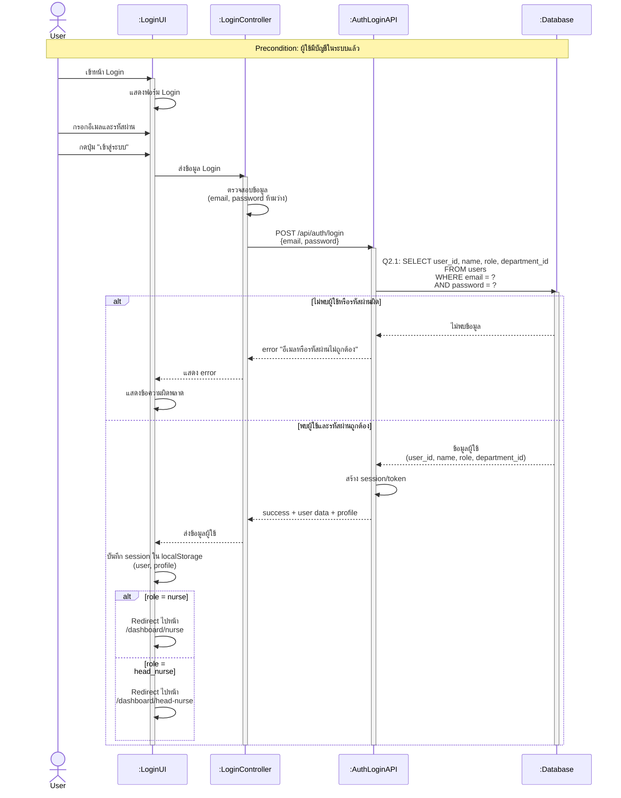

# Sequence Diagram 2 - User Login (เข้าสู่ระบบ)

```mermaid
sequenceDiagram
    actor User
    participant UI as :LoginUI
    participant Controller as :LoginController
    participant API as :AuthLoginAPI
    participant DB as :Database

    Note over User,DB: Precondition: ผู้ใช้มีบัญชีในระบบแล้ว

    User->>UI: เข้าหน้า Login
    activate UI
    UI->>UI: แสดงฟอร์ม Login

    User->>UI: กรอกอีเมลและรหัสผ่าน

    User->>UI: กดปุ่ม "เข้าสู่ระบบ"
    UI->>Controller: ส่งข้อมูล Login
    activate Controller

    Controller->>Controller: ตรวจสอบข้อมูล<br/>(email, password ห้ามว่าง)

    Controller->>API: POST /api/auth/login<br/>{email, password}
    activate API

    API->>DB: Q2.1: SELECT user_id, name, role, department_id<br/>FROM users<br/>WHERE email = ?<br/>AND password = ?
    activate DB

    alt ไม่พบผู้ใช้หรือรหัสผ่านผิด
        DB-->>API: ไม่พบข้อมูล
        API-->>Controller: error "อีเมลหรือรหัสผ่านไม่ถูกต้อง"
        Controller-->>UI: แสดง error
        UI->>UI: แสดงข้อความผิดพลาด
    else พบผู้ใช้และรหัสผ่านถูกต้อง
        DB-->>API: ข้อมูลผู้ใช้<br/>(user_id, name, role, department_id)

        API->>API: สร้าง session/token
        API-->>Controller: success + user data + profile

        Controller-->>UI: ส่งข้อมูลผู้ใช้

        UI->>UI: บันทึก session ใน localStorage<br/>(user, profile)

        alt role = nurse
            UI->>UI: Redirect ไปหน้า<br/>/dashboard/nurse
        else role = head_nurse
            UI->>UI: Redirect ไปหน้า<br/>/dashboard/head-nurse
        end
    end

    deactivate DB
    deactivate API
    deactivate Controller
    deactivate UI
```