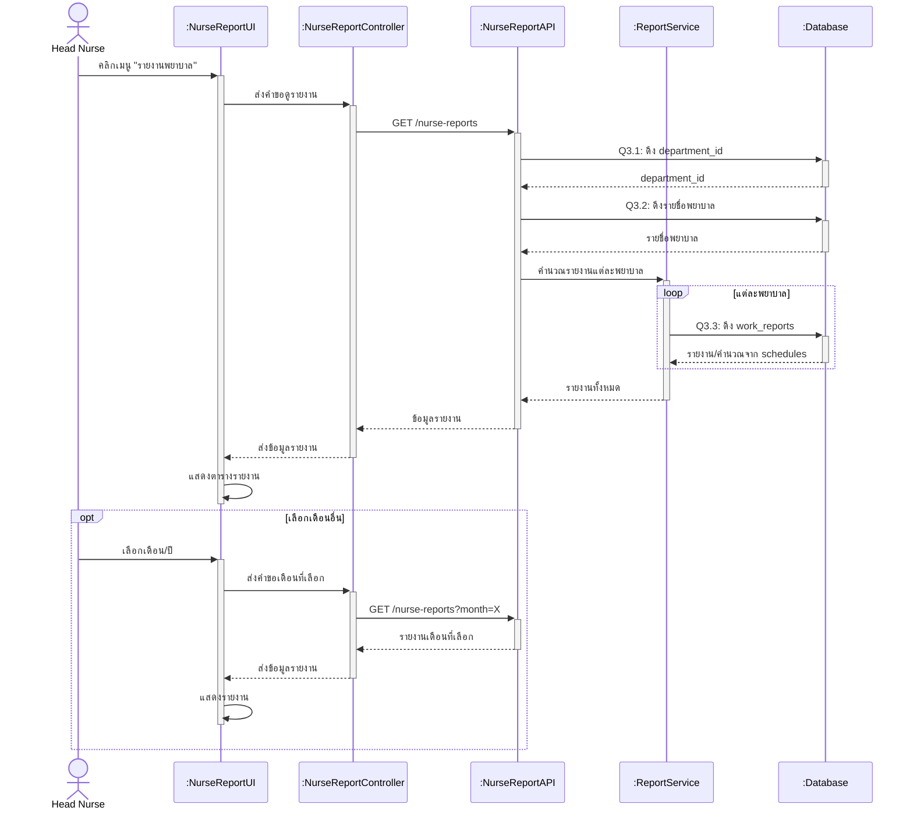

# Sequence Diagram 3 - ดูรายงานพยาบาล (หัวหน้าพยาบาล)



## คำอธิบาย Layers

| Layer | ชื่อ | หน้าที่ |
|-------|------|---------|
| **Actor** | Head Nurse | หัวหน้าพยาบาลดูรายงาน |
| **UI** | :NurseReportUI | หน้ารายงานพยาบาล (Frontend) |
| **Controller** | :NurseReportController | ควบคุมการทำงาน |
| **API** | :NurseReportAPI | API Endpoint `/api/head-nurse/nurse-reports` |
| **Service** | :ReportService | คำนวณและประมวลผลรายงาน |
| **Database** | :Database | ฐานข้อมูล Supabase |

## ขั้นตอนการทำงาน

1. **คลิกเมนู** - เข้าหน้ารายงานพยาบาล
2. **ดึงข้อมูลเริ่มต้น** - โหลดรายงานเดือนปัจจุบัน:
   - Q3.1: ดึง department_id ของหัวหน้าพยาบาล
   - Q3.2: ดึงรายชื่อพยาบาลในแผนก
   - Q3.3: ตรวจสอบ work_reports (ถ้ามี)
   - Q3.4: คำนวณจากตารางเวร (ถ้ายังไม่ส่งรายงาน)
3. **เลือกเดือน/ปี** - สามารถเปลี่ยนเดือนที่ต้องการดูได้
4. **แสดงตารางรายงาน** - แสดงข้อมูลพยาบาลแต่ละคน
5. **ดูภาพรวม** - คำนวณสถิติรวมของแผนก
6. **Export PDF** - สร้างและ download รายงาน PDF

## Database Queries

### Q3.1: ดึง department_id ของหัวหน้าพยาบาล
```sql
SELECT department_id
FROM departments
WHERE head_nurse_id = ?
```

### Q3.2: ดึงรายชื่อพยาบาลในแผนก
```sql
SELECT user_id, name, email
FROM users
WHERE department_id = ?
  AND role = 'nurse'
```

### Q3.3: