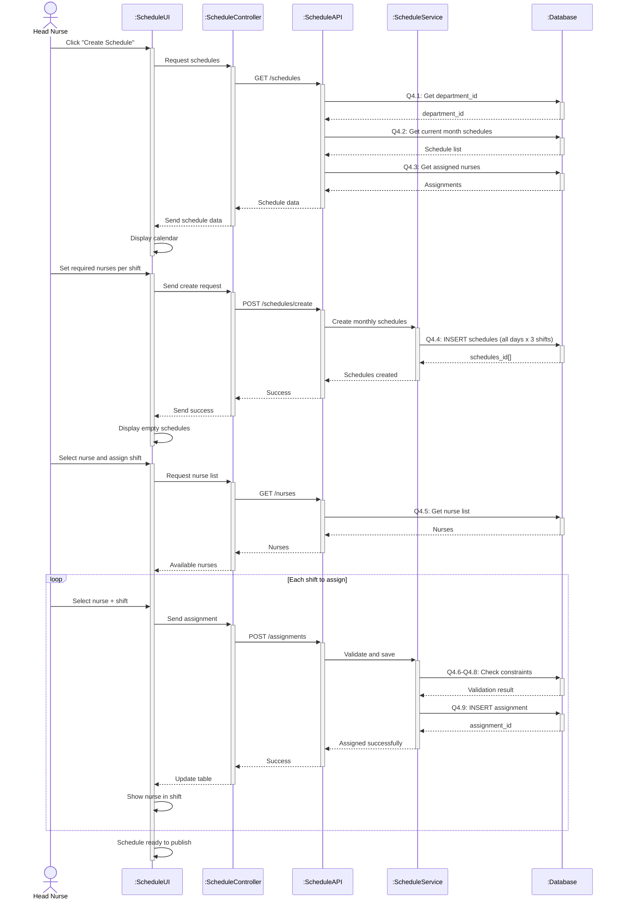

# Sequence Diagram 4 - Create Schedule (Head Nurse)

## Layer Description

| Layer | Name | Responsibility |
|-------|------|----------------|
| **Actor** | Head Nurse | Create nurse schedules |
| **UI** | :ScheduleUI | Schedule management page |
| **Controller** | :ScheduleController | Control schedule operations |
| **API** | :ScheduleAPI | API Endpoint `/api/schedules` |
| **Service** | :ScheduleService | Validate constraints and create schedules |
| **Database** | :Database | Supabase database |

## Main Steps

1. **Load schedules** - Get current month schedules (Q4.1-Q4.3)
2. **Create schedules** - Create empty schedules for whole month (Q4.4)
3. **Assign nurses** - Select nurses and assign to shifts (Q4.5-Q4.9)
