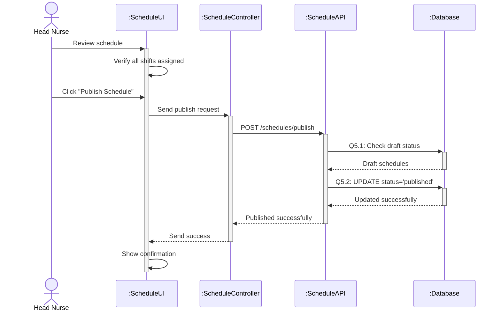

# Sequence Diagram 5 - Publish Schedule (Head Nurse)

## Layer Description

| Layer | Name | Responsibility |
|-------|------|----------------|
| **Actor** | Head Nurse | Publish schedules |
| **UI** | :ScheduleUI | Schedule management page |
| **Controller** | :ScheduleController | Control publish operation |
| **API** | :ScheduleAPI | API Endpoint `/api/schedules/publish` |
| **Database** | :Database | Supabase database |

## Main Steps

1. **Verify completeness** - Check all shifts assigned
2. **Publish** - Update status from draft to published (Q5.1-Q5.2)
