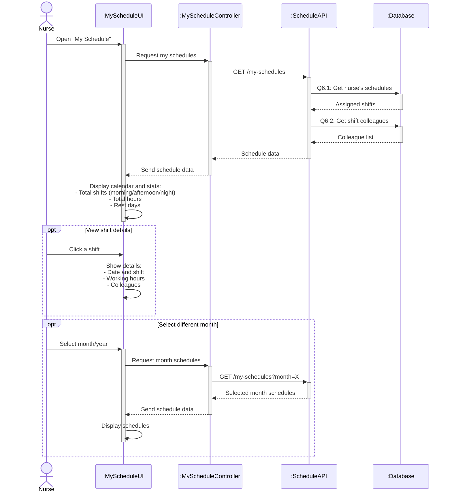

# Sequence Diagram 6 - View My Schedule (Nurse)

## Layer Description

| Layer | Name | Responsibility |
|-------|------|----------------|
| **Actor** | Nurse | View own schedules |
| **UI** | :MyScheduleUI | My schedule page |
| **Controller** | :MyScheduleController | Control schedule viewing |
| **API** | :ScheduleAPI | API Endpoint `/api/my-schedules` |
| **Database** | :Database | Supabase database |

## Main Steps

1. **Get schedules** - Fetch shifts and colleagues (Q6.1-Q6.2)
2. **Show calendar and stats** - Calculate shifts, hours, rest days
3. **View details** - Click shift to see details
