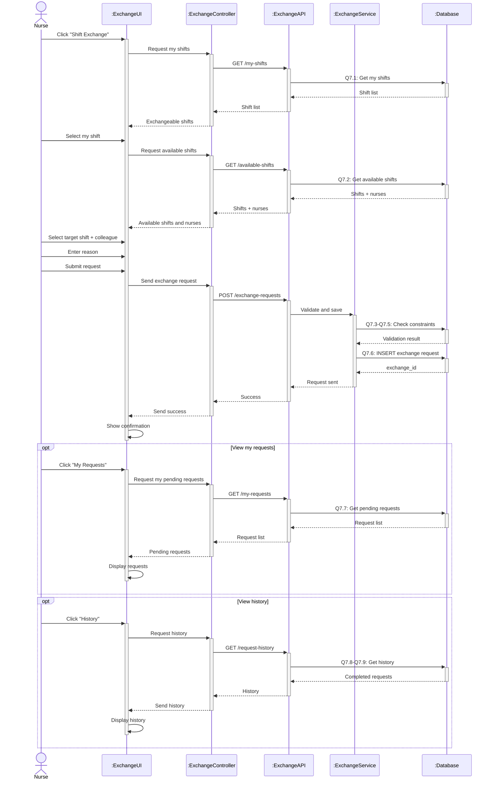

# Sequence Diagram 7 - Request Shift Exchange (Nurse)

## Layer Description

| Layer | Name | Responsibility |
|-------|------|----------------|
| **Actor** | Nurse | Request shift exchange |
| **UI** | :ExchangeUI | Shift exchange page |
| **Controller** | :ExchangeController | Control exchange operations |
| **API** | :ExchangeAPI | API Endpoint `/api/exchange-requests` |
| **Service** | :ExchangeService | Validate exchange constraints |
| **Database** | :Database | Supabase database |

## Main Steps

1. **Select my shift** - Get and select own shift (Q7.1)
2. **Select target shift** - Get and select target shift + colleague (Q7.2)
3. **Submit request** - Validate and save (Q7.3-Q7.6)
4. **Track status** - View requests and history (Q7.7-Q7.9)
