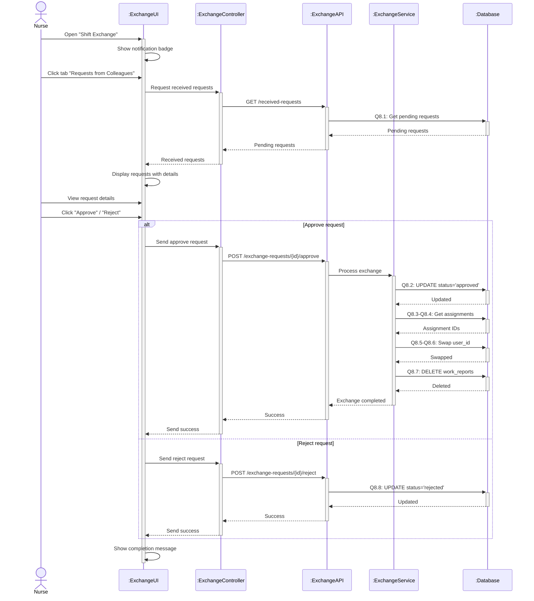

# Sequence Diagram 8 - Approve/Reject Shift Exchange (Nurse)

## Layer Description

| Layer | Name | Responsibility |
|-------|------|----------------|
| **Actor** | Nurse | Approve/reject exchange requests |
| **UI** | :ExchangeUI | Shift exchange page |
| **Controller** | :ExchangeController | Control exchange approval |
| **API** | :ExchangeAPI | API Endpoint `/api/exchange-requests/{id}` |
| **Service** | :ExchangeService | Process shift exchange |
| **Database** | :Database | Supabase database |

## Main Steps

1. **View requests** - Get pending requests (Q8.1)
2. **Approve** - Swap shifts and update data (Q8.2-Q8.7)
3. **Reject** - Update status to rejected (Q8.8)
