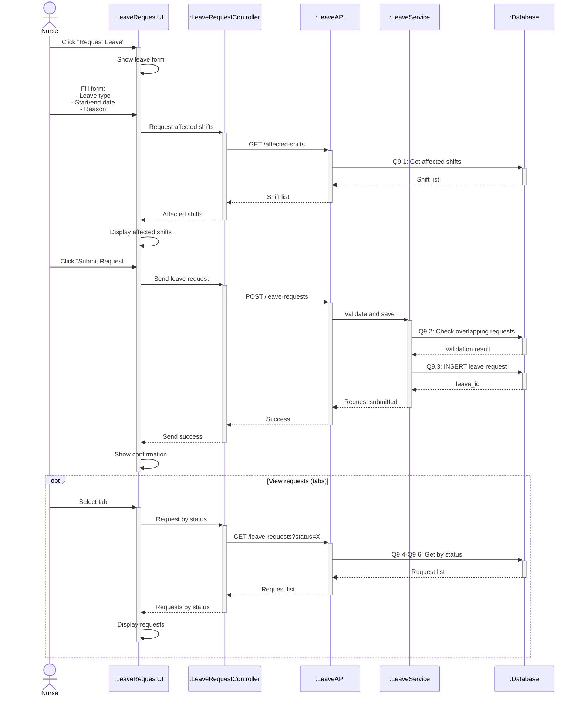

# Sequence Diagram 9 - Request Leave (Nurse)

## Layer Description

| Layer | Name | Responsibility |
|-------|------|----------------|
| **Actor** | Nurse | Request leave |
| **UI** | :LeaveRequestUI | Leave request page |
| **Controller** | :LeaveRequestController | Control leave operations |
| **API** | :LeaveAPI | API Endpoint `/api/leave-requests` |
| **Service** | :LeaveService | Validate and save leave request |
| **Database** | :Database | Supabase database |

## Main Steps

1. **Fill form** - Enter type, dates, reason
2. **View affected shifts** - Display shifts that will be lost (Q9.1)
3. **Submit request** - Validate and save (Q9.2-Q9.3)
4. **Track status** - View requests by tab (Q9.4-Q9.6)
