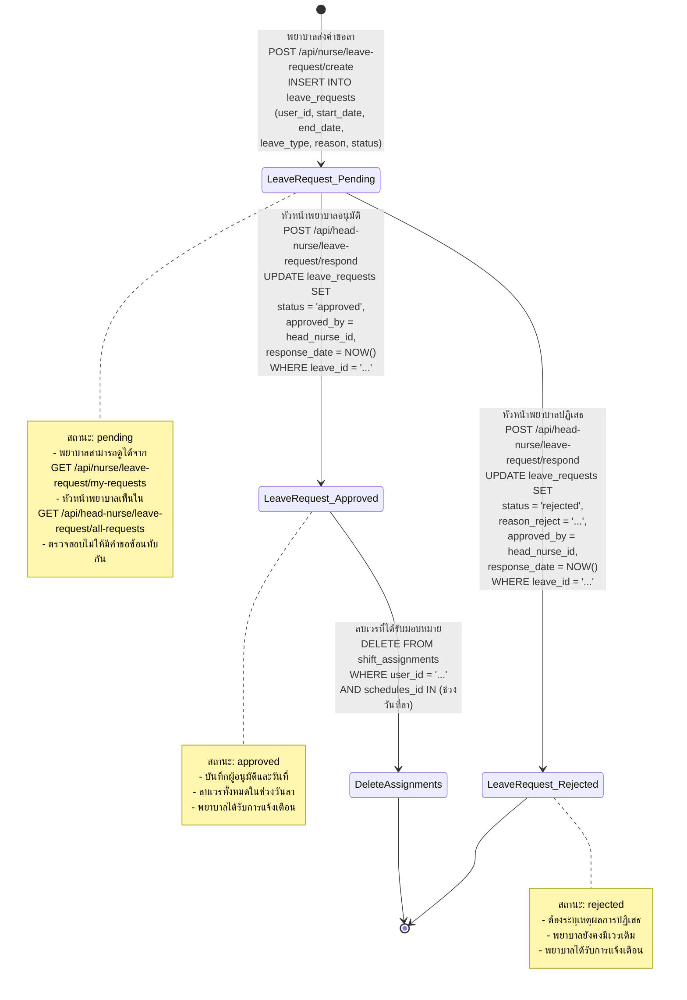
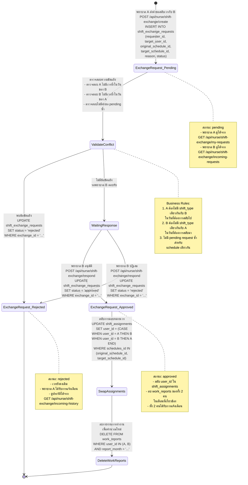

# State Diagram - Nurse Shift Management System

## 1. Leave Request State Diagram (การส่งคำขอลา)



### คำอธิบาย Leave Request States

| State | Description | Actions |
|-------|-------------|---------|
| **Pending** | คำขอลารอการพิจารณา | - พยาบาลส่งคำขอพร้อมระบุวันที่และเหตุผล<br/>- ตรวจสอบไม่ให้มีคำขอซ้อนทับกัน<br/>- รอหัวหน้าพยาบาลพิจารณา |
| **Approved** | คำขอลาได้รับการอนุมัติ | - บันทึก approved_by และ response_date<br/>- ลบเวรทั้งหมดในช่วงวันที่ลา<br/>- อัพเดทสถานะเป็น approved |
| **Rejected** | คำขอลาถูกปฏิเสธ | - บันทึกเหตุผลการปฏิเสธ (reason_reject)<br/>- บันทึก approved_by และ response_date<br/>- เวรยังคงเดิม ไม่มีการเปลี่ยนแปลง |

### Business Rules (Leave Request)

1. **Validation**: ไม่สามารถมีคำขอลาที่ช่วงวันซ้อนทับกันในสถานะ pending
2. **Approval Impact**: เมื่ออนุมัติ ระบบจะลบ shift_assignments ทั้งหมดในช่วงวันที่ลา
3. **Rejection Requirement**: ต้องระบุเหตุผลการปฏิเสธทุกครั้ง
4. **Leave Types**:
   - Predefined: 'sick', 'personal', 'vacation', 'other'
   - Custom: สามารถระบุประเภทอื่นได้ (max 50 chars)

---

## 2. Shift Exchange Request State Diagram (การส่งคำขอแลกเวร)



### คำอธิบาย Shift Exchange States

| State | Description | Actions |
|-------|-------------|---------|
| **Pending** | คำขอสลับเวรรอการตรวจสอบ | - พยาบาล A (requester) ส่งคำขอพร้อมระบุเหตุผล<br/>- ระบุเวรของตนเอง (original_schedule_id)<br/>- ระบุเวรที่ต้องการสลับ (target_schedule_id) |
| **Validate Conflict** | ตรวจสอบข้อขัดแย้ง | - ตรวจสอบ A ไม่มีเวรซ้ำในวันของ B<br/>- ตรวจสอบ B ไม่มีเวรซ้ำในวันของ A<br/>- ตรวจสอบไม่มีคำขอ pending ซ้ำ |
| **Waiting Response** | รอพยาบาล B ตอบรับ | - พยาบาล B เห็นคำขอใน incoming requests<br/>- B สามารถอนุมัติหรือปฏิเสธได้ |
| **Approved** | คำขอได้รับการอนุมัติ | - สลับ user_id ใน shift_assignments<br/>- ลบ work_reports ของทั้ง 2 คนในเดือนที่เกี่ยวข้อง<br/>- เพื่อให้คำนวณใหม่ในภายหลัง |
| **Rejected** | คำขอถูกปฏิเสธ | - เวรยังคงเดิม ไม่มีการเปลี่ยนแปลง<br/>- บันทึกประวัติไว้ใน history |

### Business Rules (Shift Exchange)

1. **Conflict Prevention**:
   - Requester (A) ต้องไม่มีเวรประเภทเดียวกันในวันที่ต้องการสลับไป
   - Target user (B) ต้องไม่มีเวรประเภทเดียวกันในวันที่ต้องการสลับมา

2. **Duplicate Prevention**: ไม่สามารถมีคำขอ pending ซ้ำสำหรับ schedule เดียวกัน

3. **Approval Impact**:
   - สลับ assignments ของทั้ง 2 คน
   - ลบ work_reports เพื่อให้คำนวณใหม่

4. **Data Integrity**:
   - ทั้ง original_schedule_id และ target_schedule_id ต้องมีอยู่จริง
   - ทั้ง 2 schedules ต้องมีการ assign ให้กับพยาบาลทั้ง 2 คน

---

## 3. ตารางสรุปสถานะทั้งหมด

### Leave Request Status Flow

```
[Start] → Pending → Approved → [End with deleted shifts]
                 ↘ Rejected → [End with original shifts]
```

### Shift Exchange Request Status Flow

```
[Start] → Pending → Validate → Waiting → Approved → [End with swapped shifts]
                           ↓              ↘ Rejected → [End with original shifts]
                      Rejected → [End]
```

---

## 4. API Endpoints ที่เกี่ยวข้อง

### Leave Request APIs

| Method | Endpoint | Role | Description |
|--------|----------|------|-------------|
| POST | `/api/nurse/leave-request/create` | Nurse | สร้างคำขอลา |
| POST | `/api/nurse/leave-request/my-requests` | Nurse | ดูคำขอลาของตนเอง |
| POST | `/api/nurse/leave-request/affected-schedules` | Nurse | ดูเวรที่จะได้รับผลกระทบ |
| POST | `/api/head-nurse/leave-request/all-requests` | Head Nurse | ดูคำขอลาทั้งหมดในแผนก |
| POST | `/api/head-nurse/leave-request/pending-count` | Head Nurse | นับจำนวนคำขอที่รอพิจารณา |
| POST | `/api/head-nurse/leave-request/respond` | Head Nurse | อนุมัติ/ปฏิเสธคำขอลา |

### Shift Exchange Request APIs

| Method | Endpoint | Role | Description |
|--------|----------|------|-------------|
| POST | `/api/nurse/shift-exchange/create` | Nurse | สร้างคำขอสลับเวร |
| POST | `/api/nurse/shift-exchange/my-requests` | Nurse | ดูคำขอที่ตนเองส่ง |
| POST | `/api/nurse/shift-exchange/incoming-requests` | Nurse | ดูคำขอที่ได้รับ (pending) |
| POST | `/api/nurse/shift-exchange/incoming-history` | Nurse | ดูประวัติคำขอที่ได้รับ |
| POST | `/api/nurse/shift-exchange/respond` | Nurse | อนุมัติ/ปฏิเสธคำขอสลับเวร |

---

## 5. Database Tables Schema

### leave_requests Table

```sql
CREATE TABLE leave_requests (
    leave_id SERIAL PRIMARY KEY,
    user_id INTEGER REFERENCES users(user_id),
    start_date DATE NOT NULL,
    end_date DATE NOT NULL,
    leave_days INTEGER,
    leave_type VARCHAR(50),
    reason TEXT,
    reason_reject TEXT,
    request_date TIMESTAMP DEFAULT NOW(),
    status VARCHAR(20) DEFAULT 'pending',
    approved_by INTEGER REFERENCES users(user_id),
    response_date TIMESTAMP
);
```

### shift_exchange_requests Table

```sql
CREATE TABLE shift_exchange_requests (
    exchange_id SERIAL PRIMARY KEY,
    requester_id INTEGER REFERENCES users(user_id),
    target_user_id INTEGER REFERENCES users(user_id),
    original_schedule_id INTEGER REFERENCES schedules(schedules_id),
    target_schedule_id INTEGER REFERENCES schedules(schedules_id),
    request_date TIMESTAMP DEFAULT NOW(),
    reason TEXT,
    status VARCHAR(20) DEFAULT 'pending'
);
```

---

## 6. Status Enumerations

### Leave Request Status
- `pending` - รอการพิจารณา
- `approved` - อนุมัติแล้ว
- `rejected` - ปฏิเสธแล้ว

### Shift Exchange Request Status
- `pending` - รอการตอบรับจากพยาบาลอีกฝ่าย
- `approved` - อนุมัติแล้ว (เวรถูกสลับแล้ว)
- `rejected` - ปฏิเสธแล้ว (โดยระบบหรือพยาบาลอีกฝ่าย)
