# Use Case 1: การออกแบบเวรเบื้องต้น และ ประกาศเวร

## Overview
Use case นี้ครอบคลุมกระบวนการทั้งหมดตั้งแต่การสร้างตารางเวรร่าง การจัดพยาบาลเข้าเวร จนถึงการประกาศเวรให้มีผลบังคับใช้

---

## Part 1: การออกแบบเวรเบื้องต้น (Schedule Planning)

### Actor Actions | System Actions

**1. เข้าเมนูจัดตารางเวร**
- Actor: หัวหน้าพยาบาลเข้าสู่หน้า Schedule Management
- System: แสดงหน้าจัดการตารางเวร พร้อมปฏิทินเดือนปัจจุบัน

**2. เลือกเดือน/ปี**
- Actor: คลิกเลือกเดือน/ปีที่ต้องการสร้างตารางเวร
- System: โหลดข้อมูลตารางเวรของเดือนที่เลือก และตรวจสอบสถานะ
```sql
-- ตรวจสอบว่ามีตารางเวรในเดือนนั้นแล้วหรือไม่
SELECT COUNT(*) FROM schedules
WHERE department_id = :dept_id
AND date >= :start_date
AND date <= :end_date;
```

**3. กำหนดจำนวนพยาบาลต่อกะ**
- Actor: ตั้งค่าจำนวนพยาบาลที่ต้องการในแต่ละกะ
  - เช้า (Morning): จำนวนพยาบาล
  - บ่าย (Afternoon): จำนวนพยาบาล
  - ดึก (Night): จำนวนพยาบาล
- System: เก็บค่าที่ตั้งไว้สำหรับการสร้างตารางเวร

**4. กดสร้างตารางเวร**
- Actor: คลิกปุ่ม "สร้างตารางเวร"
- System: สร้างตารางเวรเปล่าสำหรับทั้งเดือน (3 กะ × จำนวนวันในเดือน)
```sql
-- สร้างตารางเวรเปล่าสำหรับทั้งเดือน
INSERT INTO schedules (date, shift_type, department_id, created_by, status, required_nurse, published_date)
VALUES
  ('2025-10-01', 'morning', :dept_id, :user_id, 'draft', :morning_count, NULL),
  ('2025-10-01', 'afternoon', :dept_id, :user_id, 'draft', :afternoon_count, NULL),
  ('2025-10-01', 'night', :dept_id, :user_id, 'draft', :night_count, NULL),
  -- ... ต่อไปจนครบทุกวันในเดือน
  ('2025-10-31', 'morning', :dept_id, :user_id, 'draft', :morning_count, NULL),
  ('2025-10-31', 'afternoon', :dept_id, :user_id, 'draft', :afternoon_count, NULL),
  ('2025-10-31', 'night', :dept_id, :user_id, 'draft', :night_count, NULL);
```

**5. แสดงรายชื่อพยาบาล**
- Actor: ระบบแสดงรายชื่อพยาบาลที่สามารถจัดเวรได้
- System: ดึงข้อมูลพยาบาลในแผนกเดียวกัน
```sql
-- ดึงรายชื่อพยาบาลในแผนก
SELECT user_id, name, email
FROM users
WHERE department_id = :dept_id
AND role IN ('nurse', 'head_nurse')
AND status = 'active'
ORDER BY name;
```

**6. แสดงปฏิทินเดือนที่เลือก**
- Actor: ดูปฏิทินเดือนที่สร้างตารางเวรแล้ว
- System: แสดงปฏิทินพร้อมช่องกะเวรที่ยังว่าง (สถานะ draft)
```sql
-- ดึงตารางเวรพร้อมข้อมูลพยาบาลที่จัดแล้ว
SELECT
  s.schedules_id,
  s.date,
  s.shift_type,
  s.required_nurse,
  s.status,
  COUNT(sa.assignment_id) as assigned_count
FROM schedules s
LEFT JOIN shift_assignments sa ON s.schedules_id = sa.schedules_id
WHERE s.department_id = :dept_id
AND s.date >= :start_date
AND s.date <= :end_date
GROUP BY s.schedules_id, s.date, s.shift_type, s.required_nurse, s.status
ORDER BY s.date, s.shift_type;
```

---

## Part 2: การจัดพยาบาลเข้าเวร (Nurse Assignment)

### Actor Actions | System Actions

**7. เลือกวันที่และกะ**
- Actor: คลิกเลือกวันที่และกะที่ต้องการจัดพยาบาล
- System: เน้นกะที่เลือกและแสดงรายละเอียดกะนั้น

**8. ลากหรือคลิกจัดพยาบาลเข้าเวร**
- Actor: ลากพยาบาลไปวางในกะ หรือ เลือกพยาบาลแล้วคลิกจัดเวร
- System: ตรวจสอบเงื่อนไขธุรกิจก่อนจัดเวร
```sql
-- ตรวจสอบว่าพยาบาลถูกจัดเวรในกะนี้แล้วหรือไม่
SELECT COUNT(*) FROM shift_assignments sa
JOIN schedules s ON sa.schedules_id = s.schedules_id
WHERE sa.user_id = :nurse_id
AND s.date = :selected_date
AND s.shift_type = :selected_shift;

-- ตรวจสอบจำนวนชั่วโมงทำงานในเดือน (ต้องไม่เกิน 160 ชั่วโมง)
SELECT COUNT(*) * 8 as monthly_hours
FROM shift_assignments sa
JOIN schedules s ON sa.schedules_id = s.schedules_id
WHERE sa.user_id = :nurse_id
AND s.date >= :month_start
AND s.date <= :month_end;

-- ตรวจสอบจำนวนวันหยุดในเดือน (ต้องมีอย่างน้อย 8 วัน)
SELECT
  (SELECT DAY(LAST_DAY(:month_start))) as total_days,
  COUNT(DISTINCT s.date) as working_days
FROM shift_assignments sa
JOIN schedules s ON sa.schedules_id = s.schedules_id
WHERE sa.user_id = :nurse_id
AND s.date >= :month_start
AND s.date <= :month_end;
```

**9. บันทึกการจัดเวร**
- Actor: ระบบจัดเวรสำเร็จ
- System: บันทึกการจัดเวรลงฐานข้อมูล
```sql
-- บันทึกการจัดเวร
INSERT INTO shift_assignments (user_id, schedules_id, assigned_by, assigned_date)
VALUES (:nurse_id, :schedule_id, :head_nurse_id, NOW());
```

**10. อัปเดตสถานะการครบคน**
- Actor: ระบบแสดงสถานะใหม่ของกะ
- System: ตรวจสอบและอัปเดตสถานะว่ากะนั้นครบคนหรือยัง
```sql
-- ตรวจสอบจำนวนคนในกะปัจจุบัน
SELECT
  s.required_nurse,
  COUNT(sa.assignment_id) as current_assigned
FROM schedules s
LEFT JOIN shift_assignments sa ON s.schedules_id = sa.schedules_id
WHERE s.schedules_id = :schedule_id
GROUP BY s.schedules_id, s.required_nurse;
```

**11. ทำซ้ำจนครบทุกกะ**
- Actor: ทำการจัดเวรซ้ำในกะอื่นๆ จนครบตามต้องการ
- System: ติดตามสถานะความครบถ้วนของตารางเวรทั้งเดือน

---

## Part 3: การประกาศเวร (Schedule Publishing)

### Actor Actions | System Actions

**12. ตรวจสอบความครบถ้วน**
- Actor: หัวหน้าพยาบาลตรวจสอบว่าจัดเวรครบทุกกะแล้ว
- System: ตรวจสอบความครบถ้วนของตารางเวรทั้งเดือน
```sql
-- ตรวจสอบกะที่ยังไม่ครบคน
SELECT
  s.date,
  s.shift_type,
  s.required_nurse,
  COUNT(sa.assignment_id) as assigned_count,
  (s.required_nurse - COUNT(sa.assignment_id)) as shortage
FROM schedules s
LEFT JOIN shift_assignments sa ON s.schedules_id = sa.schedules_id
WHERE s.department_id = :dept_id
AND s.date >= :month_start
AND s.date <= :month_end
AND s.status = 'draft'
GROUP BY s.schedules_id, s.date, s.shift_type, s.required_nurse
HAVING COUNT(sa.assignment_id) < s.required_nurse
ORDER BY s.date, s.shift_type;
```

**13. กดประกาศเวร**
- Actor: คลิกปุ่ม "ประกาศเวร" เมื่อจัดเวรครบถ้วนแล้ว
- System: ตรวจสอบเงื่อนไขและเปลี่ยนสถานะเป็น published
```sql
-- อัปเดตสถานะตารางเวรเป็น published
UPDATE schedules
SET status = 'published',
    published_date = NOW(),
    published_by = :head_nurse_id
WHERE department_id = :dept_id
AND date >= :month_start
AND date <= :month_end
AND status = 'draft';
```

**14. แจ้งเตือนการประกาศ**
- Actor: ได้รับการยืนยันว่าประกาศเวรสำเร็จ
- System: บันทึก log การประกาศและส่งการแจ้งเตือน
```sql
-- บันทึก log การประกาศเวร
INSERT INTO schedule_logs (department_id, action, performed_by, action_date, details)
VALUES (:dept_id, 'PUBLISHED', :head_nurse_id, NOW(),
        CONCAT('Published schedule for ', :month_year));

-- ดึงรายชื่อพยาบาลที่ได้รับมอบหมายเพื่อส่งแจ้งเตือน
SELECT DISTINCT u.user_id, u.name, u.email
FROM users u
JOIN shift_assignments sa ON u.user_id = sa.user_id
JOIN schedules s ON sa.schedules_id = s.schedules_id
WHERE s.department_id = :dept_id
AND s.date >= :month_start
AND s.date <= :month_end
AND s.status = 'published';
```

---

## Alternative Flows (กรณีพิเศษ)

### A1: ยกเลิกการจัดเวร
- Actor: คลิกปุ่มยกเลิกการจัดเวรของพยาบาลคนใดคนหนึ่ง
- System: ลบการจัดเวรออกจากระบบ
```sql
-- ลบการจัดเวร
DELETE FROM shift_assignments
WHERE assignment_id = :assignment_id;
```

### A2: ยกเลิกตารางเวรร่างทั้งเดือน
- Actor: คลิกปุ่ม "ยกเลิกตารางเวรร่าง"
- System: ลบตารางเวรร่างทั้งเดือน
```sql
-- ลบการจัดเวรทั้งหมดในเดือน
DELETE sa FROM shift_assignments sa
JOIN schedules s ON sa.schedules_id = s.schedules_id
WHERE s.department_id = :dept_id
AND s.date >= :month_start
AND s.date <= :month_end
AND s.status = 'draft';

-- ลบตารางเวรร่าง
DELETE FROM schedules
WHERE department_id = :dept_id
AND date >= :month_start
AND date <= :month_end
AND status = 'draft';
```

### A3: แก้ไขจำนวนพยาบาลในกะ
- Actor: เปลี่ยนจำนวนพยาบาลที่ต้องการในกะใดกะหนึ่ง
- System: อัปเดตจำนวนพยาบาลที่ต้องการ
```sql
-- อัปเดตจำนวนพยาบาลในกะเดียว
UPDATE schedules
SET required_nurse = :new_count
WHERE schedules_id = :schedule_id
AND status = 'draft';

-- หรืออัปเดตทั้งเดือนสำหรับกะประเภทเดียวกัน
UPDATE schedules
SET required_nurse = :new_count
WHERE department_id = :dept_id
AND shift_type = :shift_type
AND date >= :month_start
AND date <= :month_end
AND status = 'draft';
```

---

## Sequence Diagram

```mermaid
sequenceDiagram
    participant HN as Head Nurse
    participant UI as Web Interface
    participant API as API Server
    participant DB as Database
    participant Notify as Notification System

    %% Part 1: Schedule Planning
    Note over HN,DB: Part 1: การออกแบบเวรเบื้องต้น

    HN->>UI: เข้าหน้าจัดตารางเวร
    UI->>API: GET /dashboard/head-nurse/schedule-management
    API->>DB: SELECT current month schedules
    DB-->>API: Return schedule data
    API-->>UI: Schedule data + nurse list
    UI-->>HN: แสดงปฏิทินและรายชื่อพยาบาล

    HN->>UI: เลือกเดือน/ปี
    UI->>API: POST /api/schedules/monthly
    API->>DB: SELECT schedules WHERE date BETWEEN start_date AND end_date
    DB-->>API: Existing schedules (if any)
    API-->>UI: Month schedule data
    UI-->>HN: แสดงปฏิทินเดือนที่เลือก

    HN->>UI: กำหนดจำนวนพยาบาล (เช้า:3, บ่าย:3, ดึก:2)
    HN->>UI: คลิก "สร้างตารางเวร"

    UI->>API: POST /api/schedules/create-bulk
    Note over API: Validate: no existing schedules
    API->>DB: INSERT INTO schedules (date, shift_type, required_nurse...)
    Note over DB: สร้าง ~93 records (31 days × 3 shifts)
    DB-->>API: Bulk insert success
    API-->>UI: {"schedulesCreated": 93}
    UI-->>HN: แสดงข้อความสำเร็จ + รีเฟรชปฏิทิน

    %% Part 2: Nurse Assignment
    Note over HN,DB: Part 2: การจัดพยาบาลเข้าเวร

    HN->>UI: เลือกวันที่และกะ (เช่น 1 ต.ค. กะเช้า)
    UI->>UI: เน้นกะที่เลือก แสดงรายละเอียด

    HN->>UI: ลากพยาบาลไปวางในกะ / คลิกจัดเวร

    UI->>API: POST /api/schedules/assign
    Note over API: Business Rules Validation
    API->>DB: SELECT monthly hours WHERE user_id = :nurse_id
    DB-->>API: Current monthly hours
    API->>DB: SELECT rest days calculation
    DB-->>API: Current rest days
    API->>DB: SELECT duplicate check for same shift
    DB-->>API: No duplicates found

    alt Validation Passed
        API->>DB: INSERT INTO shift_assignments
        DB-->>API: Assignment created
        API->>DB: SELECT updated schedule with assignments
        DB-->>API: Updated schedule data
        API-->>UI: {"message": "จัดเวรสำเร็จ", assignment}
        UI-->>HN: แสดงข้อความสำเร็จ + อัปเดตปฏิทิน
    else Validation Failed
        API-->>UI: {"error": "พยาบาลทำงานเกิน 160 ชั่วโมง"}
        UI-->>HN: แสดงข้อความเตือน
    end

    HN->>UI: ทำซ้ำการจัดเวรในกะอื่นๆ
    loop สำหรับทุกกะที่ต้องการ
        HN->>UI: เลือกกะใหม่ + จัดพยาบาล
        UI->>API: POST /api/schedules/assign
        API->>DB: Validate + Insert assignment
        DB-->>API: Result
        API-->>UI: Response
        UI-->>HN: Update UI
    end

    %% Part 3: Schedule Publishing
    Note over HN,DB: Part 3: การประกาศเวร

    HN->>UI: ตรวจสอบความครบถ้วน + คลิก "ประกาศเวร"

    UI->>API: POST /api/schedules/publish (implied)
    Note over API: Validate all shifts are fully staffed
    API->>DB: SELECT incomplete shifts
    alt All Shifts Complete
        API->>DB: UPDATE schedules SET status='published', published_date=NOW()
        DB-->>API: Update successful
        API->>DB: INSERT INTO schedule_logs
        DB-->>API: Log recorded
        API->>DB: SELECT assigned nurses for notification
        DB-->>API: Nurse list
        API->>Notify: Send notifications to assigned nurses
        Notify-->>API: Notifications sent
        API-->>UI: {"message": "ประกาศเวรสำเร็จ"}
        UI-->>HN: แสดงข้อความสำเร็จ + ปิดเมนูจัดเวร
    else Incomplete Shifts Found
        API-->>UI: {"error": "ยังมีกะที่ไม่ครบคน"}
        UI-->>HN: แสดงรายการกะที่ยังไม่ครบ
    end

    %% Alternative Flows
    Note over HN,DB: Alternative Flows

    alt ยกเลิกการจัดเวร
        HN->>UI: คลิก "ยกเลิก" ข้างชื่อพยาบาล
        UI->>UI: แสดง confirm dialog
        HN->>UI: ยืนยันการยกเลิก
        UI->>API: POST /api/schedules/remove-assignment
        API->>DB: DELETE FROM shift_assignments WHERE assignment_id
        DB-->>API: Deletion successful
        API-->>UI: {"message": "ยกเลิกสำเร็จ"}
        UI-->>HN: อัปเดตปฏิทิน + แสดงข้อความสำเร็จ
    end

    alt ยกเลิกตารางเวรร่างทั้งเดือน
        HN->>UI: คลิก "ยกเลิกตารางเวรร่าง"
        UI->>UI: แสดง confirm dialog
        HN->>UI: ยืนยันการยกเลิก
        UI->>API: POST /api/schedules/delete-drafts
        API->>DB: DELETE shift_assignments for draft schedules
        API->>DB: DELETE draft schedules
        DB-->>API: Deletion successful
        API-->>UI: {"message": "ยกเลิกตารางเวรร่างสำเร็จ"}
        UI-->>HN: รีเซ็ตปฏิทิน + แสดงข้อความสำเร็จ
    end

    alt แก้ไขจำนวนพยาบาลในกะ
        HN->>UI: คลิก "แก้ไข" จำนวนพยาบาล
        HN->>UI: ปรับจำนวน + ยืนยัน
        UI->>API: POST /api/schedules/update-single-requirement
        API->>DB: UPDATE schedules SET required_nurse WHERE schedules_id
        DB-->>API: Update successful
        API-->>UI: {"message": "อัปเดตสำเร็จ"}
        UI-->>HN: อัปเดตปฏิทิน + แสดงข้อความสำเร็จ
    end
```



---

## Business Rules Validation

### การตรวจสอบเงื่อนไขธุรกิจที่สำคัญ:

1. **ไม่ให้พยาบาลทำงานเกิน 160 ชั่วโมง/เดือน** (20 เวร × 8 ชั่วโมง)
2. **พยาบาลต้องมีวันหยุดอย่างน้อย 8 วัน/เดือน**
3. **ไม่ให้พยาบาลคนเดียวกันถูกจัดในกะเดียวกันซ้ำ**
4. **ตารางเวรที่ประกาศแล้วไม่สามารถแก้ไขได้**
5. **ต้องจัดเวรให้ครบทุกกะก่อนประกาศ**

### Error Handling:
```sql
-- ตรวจสอบข้อผิดพลาดทั่วไป
SELECT
  'OVER_MONTHLY_HOURS' as error_type,
  u.name,
  COUNT(*) * 8 as total_hours
FROM users u
JOIN shift_assignments sa ON u.user_id = sa.user_id
JOIN schedules s ON sa.schedules_id = s.schedules_id
WHERE s.date >= :month_start
AND s.date <= :month_end
GROUP BY u.user_id, u.name
HAVING COUNT(*) > 20;
```