# Use Case 2: การตรวจสอบตารางเวร บันทึกการทำงาน และสรุปรายงาน

## Overview
Use case นี้ครอบคลุมกระบวนการที่พยาบาลใช้งานระบบในชีวิตประจำวัน ตั้งแต่การดูตารางเวรของตนเอง บันทึกการทำงานตามตารางเวร และตรวจสอบรายงานสรุปการทำงานประจำเดือน

---

## Part 1: การตรวจสอบตารางเวร (Check Shift Schedule)

### Actor Actions | System Actions

**1. เข้าสู่ระบบ**
- Actor: พยาบาลเข้าสู่ระบบด้วย email และ password
- System: ตรวจสอบข้อมูลการเข้าสู่ระบบและสร้าง session
```sql
-- ตรวจสอบข้อมูลผู้ใช้
SELECT user_id, name, email, role, department_id, status
FROM users
WHERE email = :email
AND password_hash = SHA2(:password, 256)
AND status = 'active';
```

**2. เข้าหน้า Dashboard**
- Actor: พยาบาลเข้าสู่หน้า Dashboard หลัก
- System: แสดงภาพรวมของตารางเวรที่จะถึง
```sql
-- ดึงเวรที่จะถึงในอีก 7 วันข้างหน้า
SELECT
  s.schedules_id,
  s.date,
  s.shift_type,
  s.status,
  sa.assignment_id
FROM schedules s
JOIN shift_assignments sa ON s.schedules_id = sa.schedules_id
WHERE sa.user_id = :user_id
AND s.date BETWEEN CURDATE() AND DATE_ADD(CURDATE(), INTERVAL 7 DAY)
AND s.status = 'published'
ORDER BY s.date, s.shift_type;
```

**3. คลิกเมนู "ตารางเวรของฉัน"**
- Actor: คลิกเข้าหน้า "My Schedule"
- System: แสดงตารางเวรแบบปฏิทินของเดือนปัจจุบัน
```sql
-- ดึงตารางเวรของพยาบาลในเดือนที่เลือก
SELECT
  s.schedules_id,
  s.date,
  s.shift_type,
  s.status,
  sa.assignment_id,
  sa.assigned_date,
  d.name as department_name
FROM schedules s
JOIN shift_assignments sa ON s.schedules_id = sa.schedules_id
JOIN departments d ON s.department_id = d.department_id
WHERE sa.user_id = :user_id
AND s.date >= :month_start
AND s.date <= :month_end
ORDER BY s.date, s.shift_type;
```

**4. เลือกดูเดือนอื่น**
- Actor: คลิกเลือกเดือน/ปีที่ต้องการดู
- System: โหลดตารางเวรของเดือนที่เลือก
```sql
-- ดึงตารางเวรของเดือนที่เลือก
SELECT
  s.schedules_id,
  s.date,
  s.shift_type,
  s.status,
  sa.assignment_id,
  wr.report_id,
  wr.status as report_status
FROM schedules s
JOIN shift_assignments sa ON s.schedules_id = sa.schedules_id
LEFT JOIN work_reports wr ON sa.assignment_id = wr.assignment_id
WHERE sa.user_id = :user_id
AND s.date >= :selected_month_start
AND s.date <= :selected_month_end
ORDER BY s.date, s.shift_type;
```

**5. ดูรายละเอียดเวร**
- Actor: คลิกที่เวรใดเวรหนึ่งเพื่อดูรายละเอียด
- System: แสดงรายละเอียดของเวรนั้น รวมถึงพยาบาลคนอื่นที่เวรเดียวกัน
```sql
-- ดึงรายละเอียดเวรและพยาบาลคนอื่นในเวรเดียวกัน
SELECT
  s.schedules_id,
  s.date,
  s.shift_type,
  s.required_nurse,
  u.user_id,
  u.name as nurse_name,
  sa.assignment_id,
  wr.report_id,
  wr.status as report_status
FROM schedules s
JOIN shift_assignments sa ON s.schedules_id = sa.schedules_id
JOIN users u ON sa.user_id = u.user_id
LEFT JOIN work_reports wr ON sa.assignment_id = wr.assignment_id AND wr.user_id = :user_id
WHERE s.schedules_id = :schedule_id
ORDER BY u.name;
```

---

## Part 2: การบันทึกการทำงานตามตารางเวร (Record Work Report)

### Actor Actions | System Actions

**6. เลือกเวรที่ต้องการบันทึก**
- Actor: พยาบาลเลือกเวรที่ทำงานเสร็จแล้วเพื่อบันทึกรายงาน
- System: ตรวจสอบว่าเวรนั้นผ่านไปแล้วและยังไม่มีรายงาน
```sql
-- ตรวจสอบเวรที่สามารถบันทึกรายงานได้
SELECT
  s.schedules_id,
  s.date,
  s.shift_type,
  sa.assignment_id,
  CASE
    WHEN s.date > CURDATE() THEN 'FUTURE'
    WHEN wr.report_id IS NOT NULL THEN 'REPORTED'
    ELSE 'AVAILABLE'
  END as report_status
FROM schedules s
JOIN shift_assignments sa ON s.schedules_id = sa.schedules_id
LEFT JOIN work_reports wr ON sa.assignment_id = wr.assignment_id
WHERE sa.user_id = :user_id
AND s.schedules_id = :schedule_id;
```

**7. กรอกรายงานการทำงาน**
- Actor: กรอกข้อมูลรายงานการทำงาน
  - เวลาเข้างาน (Check-in)
  - เวลาออกงาน (Check-out)
  - ชั่วโมงทำงานจริง
  - งานที่ทำ/หมายเหตุ (ถ้ามี)
- System: บันทึกข้อมูลชั่วคราวในฟอร์ม

**8. ส่งรายงาน**
- Actor: คลิกปุ่ม "ส่งรายงาน"
- System: ตรวจสอบความถูกต้องและบันทึกรายงานลงฐานข้อมูล
```sql
-- ตรวจสอบว่ายังไม่มีรายงานซ้ำ
SELECT COUNT(*) as existing_reports
FROM work_reports
WHERE assignment_id = :assignment_id
AND user_id = :user_id;

-- บันทึกรายงานการทำงาน
INSERT INTO work_reports (
  assignment_id,
  user_id,
  check_in_time,
  check_out_time,
  actual_hours,
  notes,
  status,
  submitted_date
)
VALUES (
  :assignment_id,
  :user_id,
  :check_in_time,
  :check_out_time,
  TIMESTAMPDIFF(HOUR, :check_in_time, :check_out_time),
  :notes,
  'submitted',
  NOW()
);
```

**9. แสดงผลการบันทึก**
- Actor: ได้รับการยืนยันว่าบันทึกสำเร็จ
- System: อัปเดตสถานะเวรในปฏิทินและบันทึก log
```sql
-- บันทึก log การส่งรายงาน
INSERT INTO work_report_logs (
  report_id,
  user_id,
  action,
  action_date,
  details
)
VALUES (
  LAST_INSERT_ID(),
  :user_id,
  'SUBMITTED',
  NOW(),
  CONCAT('Submitted work report for shift on ', :shift_date, ' (', :shift_type, ')')
);
```

**10. แก้ไขรายงาน (ถ้าจำเป็น)**
- Actor: คลิกแก้ไขรายงานที่ส่งไปแล้ว (ภายใน 24 ชั่วโมง)
- System: ตรวจสอบเวลาที่ผ่านไปและอนุญาตให้แก้ไข
```sql
-- ตรวจสอบว่าส่งรายงานมานานเท่าไร
SELECT
  report_id,
  submitted_date,
  status,
  TIMESTAMPDIFF(HOUR, submitted_date, NOW()) as hours_since_submit
FROM work_reports
WHERE report_id = :report_id
AND user_id = :user_id;

-- อัปเดตรายงาน (ถ้าอนุญาต)
UPDATE work_reports
SET
  check_in_time = :new_check_in,
  check_out_time = :new_check_out,
  actual_hours = TIMESTAMPDIFF(HOUR, :new_check_in, :new_check_out),
  notes = :new_notes,
  updated_date = NOW()
WHERE report_id = :report_id
AND user_id = :user_id
AND status = 'submitted'
AND TIMESTAMPDIFF(HOUR, submitted_date, NOW()) <= 24;
```

---

## Part 3: การตรวจสอบและส่งออกสรุปรายงานประจำเดือน (Monthly Report Summary)

### Actor Actions | System Actions

**11. เข้าหน้ารายงานประจำเดือน**
- Actor: คลิกเมนู "รายงานของฉัน" หรือ "My Reports"
- System: แสดงสรุปรายงานเดือนปัจจุบัน
```sql
-- สรุปรายงานการทำงานประจำเดือน
SELECT
  COUNT(DISTINCT s.schedules_id) as total_shifts,
  COUNT(wr.report_id) as submitted_reports,
  SUM(wr.actual_hours) as total_hours,
  SUM(CASE WHEN s.shift_type = 'morning' THEN 1 ELSE 0 END) as morning_shifts,
  SUM(CASE WHEN s.shift_type = 'afternoon' THEN 1 ELSE 0 END) as afternoon_shifts,
  SUM(CASE WHEN s.shift_type = 'night' THEN 1 ELSE 0 END) as night_shifts,
  COUNT(CASE WHEN wr.report_id IS NULL AND s.date <= CURDATE() THEN 1 END) as missing_reports
FROM schedules s
JOIN shift_assignments sa ON s.schedules_id = sa.schedules_id
LEFT JOIN work_reports wr ON sa.assignment_id = wr.assignment_id
WHERE sa.user_id = :user_id
AND s.date >= :month_start
AND s.date <= :month_end
AND s.status = 'published';
```

**12. ดูรายละเอียดรายงาน**
- Actor: ดูรายละเอียดการทำงานแต่ละวัน
- System: แสดงตารางรายละเอียดแต่ละเวร
```sql
-- รายละเอียดรายงานการทำงานทุกเวร
SELECT
  s.date,
  s.shift_type,
  wr.check_in_time,
  wr.check_out_time,
  wr.actual_hours,
  wr.notes,
  wr.status,
  wr.submitted_date,
  CASE
    WHEN wr.report_id IS NULL AND s.date <= CURDATE() THEN 'missing'
    WHEN wr.report_id IS NULL AND s.date > CURDATE() THEN 'upcoming'
    ELSE 'completed'
  END as report_status
FROM schedules s
JOIN shift_assignments sa ON s.schedules_id = sa.schedules_id
LEFT JOIN work_reports wr ON sa.assignment_id = wr.assignment_id
WHERE sa.user_id = :user_id
AND s.date >= :month_start
AND s.date <= :month_end
AND s.status = 'published'
ORDER BY s.date, s.shift_type;
```

**13. เลือกเดือนที่ต้องการดูรายงาน**
- Actor: เลือกเดือน/ปีที่ต้องการดูรายงาน
- System: โหลดสรุปรายงานของเดือนที่เลือก (ทำซ้ำขั้นตอนที่ 11-12)

**14. ส่งออกรายงานเป็น PDF**
- Actor: คลิกปุ่ม "ส่งออกรายงาน" หรือ "Export Report"
- System: สร้างไฟล์ PDF พร้อมข้อมูลสรุป
```sql
-- ดึงข้อมูลครบถ้วนสำหรับ PDF
SELECT
  u.name as nurse_name,
  u.email,
  d.name as department_name,
  s.date,
  s.shift_type,
  wr.check_in_time,
  wr.check_out_time,
  wr.actual_hours,
  wr.notes,
  wr.status,
  wr.submitted_date
FROM users u
JOIN departments d ON u.department_id = d.department_id
JOIN shift_assignments sa ON u.user_id = sa.user_id
JOIN schedules s ON sa.schedules_id = s.schedules_id
LEFT JOIN work_reports wr ON sa.assignment_id = wr.assignment_id
WHERE u.user_id = :user_id
AND s.date >= :month_start
AND s.date <= :month_end
AND s.status = 'published'
ORDER BY s.date, s.shift_type;

-- บันทึก log การส่งออกรายงาน
INSERT INTO export_logs (
  user_id,
  export_type,
  export_date,
  month_year,
  file_name
)
VALUES (
  :user_id,
  'PDF',
  NOW(),
  :month_year,
  CONCAT('work_report_', :user_id, '_', :month_year, '.pdf')
);
```

**15. ดาวน์โหลดไฟล์รายงาน**
- Actor: ดาวน์โหลดไฟล์ PDF ที่สร้างเสร็จ
- System: ส่งไฟล์ให้พยาบาลดาวน์โหลด และบันทึกประวัติการดาวน์โหลด

---

## Alternative Flows (กรณีพิเศษ)

### A1: ลืมบันทึกรายงานการทำงาน
- Actor: ระบบแจ้งเตือนว่ามีเวรที่ยังไม่ได้บันทึกรายงาน
- System: แสดงรายการเวรที่ค้างการบันทึก
```sql
-- หาเวรที่ผ่านไปแล้วแต่ยังไม่มีรายงาน
SELECT
  s.schedules_id,
  s.date,
  s.shift_type,
  sa.assignment_id,
  DATEDIFF(CURDATE(), s.date) as days_overdue
FROM schedules s
JOIN shift_assignments sa ON s.schedules_id = sa.schedules_id
LEFT JOIN work_reports wr ON sa.assignment_id = wr.assignment_id
WHERE sa.user_id = :user_id
AND s.date < CURDATE()
AND wr.report_id IS NULL
AND s.status = 'published'
ORDER BY s.date DESC;
```

### A2: ยกเลิกรายงาน (กรณีบันทึกผิด)
- Actor: คลิกปุ่ม "ยกเลิกรายงาน" (ภายใน 24 ชั่วโมง)
- System: เปลี่ยนสถานะรายงานเป็น cancelled
```sql
-- ยกเลิกรายงาน
UPDATE work_reports
SET
  status = 'cancelled',
  updated_date = NOW()
WHERE report_id = :report_id
AND user_id = :user_id
AND TIMESTAMPDIFF(HOUR, submitted_date, NOW()) <= 24;

-- บันทึก log
INSERT INTO work_report_logs (
  report_id,
  user_id,
  action,
  action_date,
  details
)
VALUES (
  :report_id,
  :user_id,
  'CANCELLED',
  NOW(),
  'Report cancelled by user within 24 hours'
);
```

### A3: ส่งออกรายงานเป็น Excel/CSV
- Actor: เลือกรูปแบบ Excel หรือ CSV แทน PDF
- System: สร้างไฟล์ตามรูปแบบที่เลือก
```sql
-- ข้อมูลเดียวกับ PDF แต่ export format ต่างกัน
SELECT
  s.date as 'วันที่',
  s.shift_type as 'กะ',
  wr.check_in_time as 'เวลาเข้างาน',
  wr.check_out_time as 'เวลาออกงาน',
  wr.actual_hours as 'ชั่วโมงทำงาน',
  wr.notes as 'หมายเหตุ',
  wr.status as 'สถานะ'
FROM schedules s
JOIN shift_assignments sa ON s.schedules_id = sa.schedules_id
LEFT JOIN work_reports wr ON sa.assignment_id = wr.assignment_id
WHERE sa.user_id = :user_id
AND s.date >= :month_start
AND s.date <= :month_end
ORDER BY s.date, s.shift_type;
```

### A4: ไม่มีรายงานในเดือนที่เลือก
- Actor: เลือกดูรายงานเดือนที่ไม่มีตารางเวร
- System: แสดงข้อความว่าไม่มีข้อมูล
```sql
-- ตรวจสอบว่ามีตารางเวรในเดือนนั้นหรือไม่
SELECT COUNT(*) as shift_count
FROM schedules s
JOIN shift_assignments sa ON s.schedules_id = sa.schedules_id
WHERE sa.user_id = :user_id
AND s.date >= :month_start
AND s.date <= :month_end;
```

---

## Sequence Diagram

```mermaid
sequenceDiagram
    participant N as Nurse
    participant UI as Web Interface
    participant API as API Server
    participant DB as Database
    participant Export as Export Service

    %% Part 1: Check Schedule
    Note over N,DB: Part 1: การตรวจสอบตารางเวร

    N->>UI: เข้าสู่ระบบ
    UI->>API: POST /api/auth/login
    API->>DB: SELECT user WHERE email AND password_hash
    DB-->>API: User data
    API-->>UI: Session token + user data
    UI-->>N: Redirect to Dashboard

    N->>UI: คลิก "ตารางเวรของฉัน"
    UI->>API: GET /api/nurse/my-schedule?month=:month&year=:year
    API->>DB: SELECT schedules + assignments WHERE user_id
    DB-->>API: Schedule data
    API-->>UI: Monthly schedule with assignments
    UI-->>N: แสดงปฏิทินเวรประจำเดือน

    N->>UI: คลิกดูรายละเอียดเวร
    UI->>API: GET /api/schedules/:scheduleId/details
    API->>DB: SELECT schedule details + co-workers
    DB-->>API: Detailed shift data
    API-->>UI: Shift details + nurse list
    UI-->>N: แสดงรายละเอียดเวรและพยาบาลคนอื่น

    %% Part 2: Record Work Report
    Note over N,DB: Part 2: การบันทึกการทำงาน

    N->>UI: เลือกเวรที่ต้องการบันทึก
    UI->>API: GET /api/assignments/:assignmentId/report-status
    API->>DB: SELECT existing report + validate date
    DB-->>API: Report status

    alt Shift Available for Report
        API-->>UI: {"canReport": true}
        UI-->>N: แสดงฟอร์มบันทึกรายงาน

        N->>UI: กรอกข้อมูล (เวลาเข้า-ออก, หมายเหตุ)
        N->>UI: คลิก "ส่งรายงาน"

        UI->>API: POST /api/work-reports
        API->>DB: SELECT check duplicate report
        DB-->>API: No duplicates
        API->>DB: INSERT INTO work_reports
        DB-->>API: Report created
        API->>DB: INSERT INTO work_report_logs
        DB-->>API: Log recorded
        API-->>UI: {"message": "บันทึกรายงานสำเร็จ"}
        UI-->>N: แสดงข้อความสำเร็จ + อัปเดตปฏิทิน
    else Shift Not Available
        API-->>UI: {"canReport": false, "reason": "FUTURE_DATE"}
        UI-->>N: แสดงข้อความเตือน
    end

    alt Edit Report (within 24h)
        N->>UI: คลิก "แก้ไขรายงาน"
        UI->>API: GET /api/work-reports/:reportId
        API->>DB: SELECT report + check time limit
        DB-->>API: Report data
        API-->>UI: Report data (if editable)
        UI-->>N: แสดงฟอร์มแก้ไข

        N->>UI: แก้ไขข้อมูล + ยืนยัน
        UI->>API: PUT /api/work-reports/:reportId
        API->>DB: UPDATE work_reports WHERE within 24h
        DB-->>API: Updated
        API-->>UI: {"message": "แก้ไขสำเร็จ"}
        UI-->>N: แสดงข้อความสำเร็จ
    end

    %% Part 3: Monthly Report Summary
    Note over N,Export: Part 3: สรุปรายงานประจำเดือน

    N->>UI: คลิก "รายงานของฉัน"
    UI->>API: GET /api/nurse/reports?month=:month&year=:year
    API->>DB: SELECT summary + detailed reports
    DB-->>API: Monthly report data
    API-->>UI: Summary + details
    UI-->>N: แสดงสรุปรายงาน (ชั่วโมง, จำนวนเวร, รายงานที่ขาด)

    N->>UI: คลิก "ส่งออกรายงาน" → เลือก PDF
    UI->>API: POST /api/reports/export
    API->>DB: SELECT complete report data for export
    DB-->>API: Full report data
    API->>Export: Generate PDF (nurse info, shifts, hours)
    Export-->>API: PDF file buffer
    API->>DB: INSERT INTO export_logs
    DB-->>API: Log recorded
    API-->>UI: PDF file
    UI-->>N: ดาวน์โหลดไฟล์ PDF

    %% Alternative Flows
    Note over N,DB: Alternative Flows

    alt Missing Reports Alert
        UI->>API: GET /api/nurse/missing-reports
        API->>DB: SELECT shifts without reports
        DB-->>API: Missing reports list
        API-->>UI: List of overdue reports
        UI-->>N: แสดงแจ้งเตือน "มีเวรที่ยังไม่ได้บันทึก"
    end

    alt Cancel Report (within 24h)
        N->>UI: คลิก "ยกเลิกรายงาน"
        UI->>UI: Confirm dialog
        N->>UI: ยืนยันยกเลิก
        UI->>API: DELETE /api/work-reports/:reportId
        API->>DB: UPDATE status = 'cancelled'
        DB-->>API: Cancelled
        API-->>UI: {"message": "ยกเลิกสำเร็จ"}
        UI-->>N: อัปเดตปฏิทิน + แสดงข้อความ
    end

    alt Export Excel/CSV
        N->>UI: เลือกรูปแบบ Excel/CSV
        UI->>API: POST /api/reports/export?format=excel
        API->>DB: SELECT report data
        DB-->>API: Report data
        API->>Export: Generate Excel/CSV
        Export-->>API: File buffer
        API-->>UI: Excel/CSV file
        UI-->>N: ดาวน์โหลดไฟล์
    end
```



---

## Business Rules Validation

### การตรวจสอบเงื่อนไขธุรกิจที่สำคัญ:

1. **บันทึกรายงานได้เฉพาะเวรที่ผ่านไปแล้ว** (ไม่สามารถบันทึกล่วงหน้าได้)
2. **แก้ไขรายงานได้ภายใน 24 ชั่วโมง** หลังส่งรายงาน
3. **ไม่สามารถบันทึกรายงานซ้ำ** สำหรับเวรเดียวกัน
4. **ยกเลิกรายงานได้ภายใน 24 ชั่วโมง** (เปลี่ยนสถานะเป็น cancelled)
5. **ส่งออกรายงานได้เฉพาะเดือนที่มีตารางเวร**

### Error Handling:
```sql
-- ตรวจสอบข้อผิดพลาดทั่วไป

-- 1. บันทึกรายงานล่วงหน้า
SELECT
  CASE
    WHEN s.date > CURDATE() THEN 'ERROR: Cannot report future shift'
    ELSE 'OK'
  END as validation
FROM schedules s
WHERE s.schedules_id = :schedule_id;

-- 2. รายงานซ้ำ
SELECT
  CASE
    WHEN COUNT(wr.report_id) > 0 THEN 'ERROR: Report already exists'
    ELSE 'OK'
  END as validation
FROM work_reports wr
WHERE wr.assignment_id = :assignment_id
AND wr.user_id = :user_id
AND wr.status != 'cancelled';

-- 3. แก้ไขหลัง 24 ชั่วโมง
SELECT
  CASE
    WHEN TIMESTAMPDIFF(HOUR, wr.submitted_date, NOW()) > 24
    THEN 'ERROR: Cannot edit after 24 hours'
    ELSE 'OK'
  END as validation
FROM work_reports wr
WHERE wr.report_id = :report_id;

-- 4. ส่งออกรายงานเดือนที่ไม่มีข้อมูล
SELECT
  CASE
    WHEN COUNT(*) = 0 THEN 'ERROR: No data for this month'
    ELSE 'OK'
  END as validation
FROM schedules s
JOIN shift_assignments sa ON s.schedules_id = sa.schedules_id
WHERE sa.user_id = :user_id
AND s.date >= :month_start
AND s.date <= :month_end;
```

---

## Data Validation

### ข้อมูลที่ต้องตรวจสอบก่อนบันทึก:

```sql
-- ตรวจสอบความถูกต้องของเวลา
SELECT
  CASE
    WHEN :check_in_time >= :check_out_time
    THEN 'ERROR: Check-out must be after check-in'
    WHEN TIMESTAMPDIFF(HOUR, :check_in_time, :check_out_time) > 12
    THEN 'ERROR: Shift cannot exceed 12 hours'
    WHEN TIMESTAMPDIFF(HOUR, :check_in_time, :check_out_time) < 6
    THEN 'WARNING: Shift less than 6 hours'
    ELSE 'OK'
  END as time_validation;

-- ตรวจสอบจำนวนชั่วโมงรวมในเดือน
SELECT
  SUM(wr.actual_hours) as current_hours,
  CASE
    WHEN SUM(wr.actual_hours) + :new_hours > 160
    THEN 'WARNING: Exceeds 160 hours limit'
    ELSE 'OK'
  END as monthly_limit_check
FROM work_reports wr
JOIN shift_assignments sa ON wr.assignment_id = sa.assignment_id
JOIN schedules s ON sa.schedules_id = s.schedules_id
WHERE wr.user_id = :user_id
AND s.date >= :month_start
AND s.date <= :month_end
AND wr.status = 'submitted';
```
