# Use Case 3: การวิเคราะห์ความต้องการจากรายงานรายเดือน (สำหรับหัวหน้าพยาบาล)

## Overview
Use case นี้ครอบคลุมกระบวนการที่หัวหน้าพยาบาลใช้ในการวิเคราะห์รายงานการทำงานของพยาบาลในแผนก เพื่อตรวจสอบการกระจายภาระงาน ความเหมาะสมของตารางเวร และวางแผนการจัดเวรในเดือนถัดไป

---

## Part 1: การเข้าถึงและแสดงรายงานทั้งหมด (Access Reports Dashboard)

### Actor Actions | System Actions

**1. เข้าสู่หน้ารายงานพยาบาล**
- Actor: หัวหน้าพยาบาลคลิกเมนู "Nurse Reports" หรือ "รายงานพยาบาล"
- System: แสดงหน้าภาพรวมรายงานของพยาบาลทั้งหมดในแผนก
```sql
-- ดึงข้อมูลแผนกของหัวหน้าพยาบาล
SELECT department_id, department_name
FROM departments
WHERE head_nurse_id = :user_id;
```

**2. เลือกเดือนที่ต้องการดู**
- Actor: เลือกเดือน/ปีที่ต้องการวิเคราะห์
- System: โหลดรายงานของเดือนที่เลือก
```sql
-- ดึงรายงานของพยาบาลทั้งหมดในแผนกสำหรับเดือนที่เลือก
SELECT
  u.user_id,
  u.name,
  u.email,
  u.pic_profile,
  wr.report_id,
  wr.report_month,
  wr.work_days_count,
  wr.shifts_count,
  wr.total_hours,
  wr.morning_shifts,
  wr.afternoon_shifts,
  wr.night_shifts,
  wr.rest_days,
  wr.submitted_at
FROM users u
LEFT JOIN work_reports wr ON u.user_id = wr.user_id AND wr.report_month = :report_month
WHERE u.department_id = :department_id
AND u.role IN ('nurse', 'head_nurse')
AND u.user_id != :head_nurse_id  -- ไม่รวมตัวหัวหน้าเอง (ถ้าต้องการ)
ORDER BY u.name;
```

**3. แสดงภาพรวมสถิติแผนก**
- Actor: ดูภาพรวมสถิติของแผนกทั้งหมด
- System: คำนวณและแสดงสถิติรวม
```sql
-- สถิติรวมของแผนกในเดือนนี้
SELECT
  COUNT(DISTINCT u.user_id) as total_nurses,
  COUNT(wr.report_id) as submitted_reports,
  SUM(wr.work_days_count) as total_work_days,
  SUM(wr.shifts_count) as total_shifts,
  SUM(wr.total_hours) as total_hours,
  AVG(wr.total_hours) as avg_hours_per_nurse,
  AVG(wr.rest_days) as avg_rest_days,
  SUM(wr.morning_shifts) as total_morning_shifts,
  SUM(wr.afternoon_shifts) as total_afternoon_shifts,
  SUM(wr.night_shifts) as total_night_shifts
FROM users u
LEFT JOIN work_reports wr ON u.user_id = wr.user_id AND wr.report_month = :report_month
WHERE u.department_id = :department_id
AND u.role IN ('nurse', 'head_nurse');
```

---

## Part 2: การวิเคราะห์และตรวจสอบความผิดปกติ (Analysis & Anomaly Detection)

### Actor Actions | System Actions

**4. ตรวจสอบพยาบาลที่ทำงานมากเกินไป**
- Actor: ดูรายชื่อพยาบาลที่อาจทำงานหนักเกินไป
- System: วิเคราะห์และแสดงพยาบาลที่มีชั่วโมงทำงานสูง
```sql
-- หาพยาบาลที่ทำงานเกิน 160 ชั่วโมง หรือพักน้อยกว่า 8 วัน
SELECT
  u.user_id,
  u.name,
  wr.total_hours,
  wr.work_days_count,
  wr.shifts_count,
  wr.rest_days,
  CASE
    WHEN wr.total_hours > 160 THEN 'OVERWORK'
    WHEN wr.rest_days < 8 THEN 'INSUFFICIENT_REST'
    WHEN wr.total_hours > 140 THEN 'HIGH_WORKLOAD'
    ELSE 'NORMAL'
  END as workload_status,
  (wr.total_hours - 160) as overtime_hours
FROM users u
JOIN work_reports wr ON u.user_id = wr.user_id
WHERE u.department_id = :department_id
AND wr.report_month = :report_month
AND (wr.total_hours > 140 OR wr.rest_days < 8)
ORDER BY wr.total_hours DESC;
```

**5. เปรียบเทียบการกระจายกะ**
- Actor: ดูการกระจายกะของพยาบาลแต่ละคน
- System: แสดงกราฟหรือตารางเปรียบเทียบ
```sql
-- เปรียบเทียบการกระจายกะระหว่างพยาบาล
SELECT
  u.user_id,
  u.name,
  wr.morning_shifts,
  wr.afternoon_shifts,
  wr.night_shifts,
  wr.shifts_count,
  ROUND((wr.morning_shifts / wr.shifts_count * 100), 1) as morning_percent,
  ROUND((wr.afternoon_shifts / wr.shifts_count * 100), 1) as afternoon_percent,
  ROUND((wr.night_shifts / wr.shifts_count * 100), 1) as night_percent,
  CASE
    WHEN wr.night_shifts > (wr.shifts_count * 0.4) THEN 'HIGH_NIGHT_SHIFTS'
    ELSE 'BALANCED'
  END as shift_distribution_status
FROM users u
JOIN work_reports wr ON u.user_id = wr.user_id
WHERE u.department_id = :department_id
AND wr.report_month = :report_month
ORDER BY wr.night_shifts DESC;
```

**6. วิเคราะห์แนวโน้มเมื่อเทียบกับเดือนก่อน**
- Actor: ดูการเปลี่ยนแปลงของภาระงานเมื่อเทียบกับเดือนก่อน
- System: คำนวณและแสดงแนวโน้ม
```sql
-- เปรียบเทียบกับเดือนก่อนหน้า
SELECT
  u.user_id,
  u.name,
  wr_current.total_hours as current_hours,
  wr_previous.total_hours as previous_hours,
  (wr_current.total_hours - wr_previous.total_hours) as hours_diff,
  wr_current.rest_days as current_rest_days,
  wr_previous.rest_days as previous_rest_days,
  (wr_current.rest_days - wr_previous.rest_days) as rest_days_diff,
  CASE
    WHEN (wr_current.total_hours - wr_previous.total_hours) > 20 THEN 'INCREASED'
    WHEN (wr_current.total_hours - wr_previous.total_hours) < -20 THEN 'DECREASED'
    ELSE 'STABLE'
  END as trend
FROM users u
JOIN work_reports wr_current ON u.user_id = wr_current.user_id
LEFT JOIN work_reports wr_previous ON u.user_id = wr_previous.user_id
WHERE u.department_id = :department_id
AND wr_current.report_month = :current_month
AND wr_previous.report_month = DATE_FORMAT(DATE_SUB(STR_TO_DATE(CONCAT(:current_month, '-01'), '%Y-%m-%d'), INTERVAL 1 MONTH), '%Y-%m')
ORDER BY hours_diff DESC;
```

---

## Part 3: การดูรายละเอียดพยาบาลแต่ละคน (Individual Nurse Details)

### Actor Actions | System Actions

**7. คลิกดูรายละเอียดพยาบาล**
- Actor: คลิกที่ชื่อพยาบาลเพื่อดูรายละเอียดเพิ่มเติม
- System: แสดงข้อมูลรายละเอียดของพยาบาลคนนั้น
```sql
-- ดึงข้อมูลรายละเอียดพยาบาล
SELECT
  u.user_id,
  u.name,
  u.email,
  u.phone,
  u.pic_profile,
  wr.report_month,
  wr.work_days_count,
  wr.shifts_count,
  wr.total_hours,
  wr.morning_shifts,
  wr.afternoon_shifts,
  wr.night_shifts,
  wr.rest_days,
  wr.submitted_at
FROM users u
JOIN work_reports wr ON u.user_id = wr.user_id
WHERE u.user_id = :nurse_id
AND wr.report_month = :report_month;
```

**8. ดูประวัติการทำงาน 6 เดือนย้อนหลัง**
- Actor: ดูแนวโน้มการทำงานของพยาบาลในระยะยาว
- System: แสดงกราฟและตารางข้อมูล 6 เดือน
```sql
-- ดึงประวัติ 6 เดือนของพยาบาล
SELECT
  report_month,
  work_days_count,
  shifts_count,
  total_hours,
  morning_shifts,
  afternoon_shifts,
  night_shifts,
  rest_days,
  submitted_at
FROM work_reports
WHERE user_id = :nurse_id
ORDER BY report_month DESC
LIMIT 6;
```

**9. ดูตารางเวรที่ทำจริงในเดือนนี้**
- Actor: ดูรายละเอียดเวรที่พยาบาลทำในเดือนนี้
- System: แสดงรายการเวรทั้งหมด
```sql
-- ดึงรายละเอียดเวรทั้งหมดในเดือน
SELECT
  s.date,
  s.shift_type,
  sa.assignment_id,
  sa.assigned_date,
  s.schedules_id
FROM schedules s
JOIN shift_assignments sa ON s.schedules_id = sa.schedules_id
WHERE sa.user_id = :nurse_id
AND s.date >= :month_start
AND s.date <= :month_end
AND s.status = 'published'
ORDER BY s.date, s.shift_type;
```

---

## Part 4: การส่งออกและรายงานสรุป (Export & Summary Reports)

### Actor Actions | System Actions

**10. สร้างรายงานสรุปแผนก**
- Actor: คลิกปุ่ม "สร้างรายงานสรุป"
- System: รวบรวมข้อมูลเพื่อสร้างรายงานสรุป
```sql
-- ข้อมูลสรุปแผนกสำหรับรายงาน
SELECT
  d.department_name,
  COUNT(DISTINCT u.user_id) as total_nurses,
  SUM(wr.work_days_count) as total_work_days,
  SUM(wr.shifts_count) as total_shifts,
  SUM(wr.total_hours) as total_hours,
  AVG(wr.total_hours) as avg_hours_per_nurse,
  MIN(wr.total_hours) as min_hours,
  MAX(wr.total_hours) as max_hours,
  AVG(wr.rest_days) as avg_rest_days,
  SUM(wr.morning_shifts) as total_morning,
  SUM(wr.afternoon_shifts) as total_afternoon,
  SUM(wr.night_shifts) as total_night,
  COUNT(CASE WHEN wr.total_hours > 160 THEN 1 END) as overwork_count,
  COUNT(CASE WHEN wr.rest_days < 8 THEN 1 END) as insufficient_rest_count
FROM departments d
JOIN users u ON d.department_id = u.department_id
JOIN work_reports wr ON u.user_id = wr.user_id
WHERE d.department_id = :department_id
AND wr.report_month = :report_month
GROUP BY d.department_id, d.department_name;
```

**11. ส่งออกรายงานเป็น PDF/Excel**
- Actor: เลือกรูปแบบและคลิก "Export"
- System: สร้างไฟล์และให้ดาวน์โหลด
```sql
-- ข้อมูลครบถ้วนสำหรับ Export
SELECT
  u.user_id,
  u.name,
  u.email,
  wr.report_month,
  wr.work_days_count,
  wr.shifts_count,
  wr.total_hours,
  wr.morning_shifts,
  wr.afternoon_shifts,
  wr.night_shifts,
  wr.rest_days,
  wr.submitted_at,
  CASE
    WHEN wr.total_hours > 160 THEN 'OVERWORK'
    WHEN wr.rest_days < 8 THEN 'INSUFFICIENT_REST'
    WHEN wr.total_hours > 140 THEN 'HIGH_WORKLOAD'
    ELSE 'NORMAL'
  END as workload_status
FROM users u
JOIN work_reports wr ON u.user_id = wr.user_id
WHERE u.department_id = :department_id
AND wr.report_month = :report_month
ORDER BY u.name;

-- บันทึก log การ export
INSERT INTO export_logs (
  user_id,
  export_type,
  export_date,
  month_year,
  file_name,
  department_id
)
VALUES (
  :head_nurse_id,
  'DEPARTMENT_REPORT',
  NOW(),
  :report_month,
  CONCAT('dept_report_', :department_id, '_', :report_month, '.pdf'),
  :department_id
);
```

**12. กรองและค้นหาพยาบาล**
- Actor: ใช้ตัวกรองค้นหาพยาบาลตามเงื่อนไข
- System: แสดงผลลัพธ์ที่กรองแล้ว
```sql
-- กรองพยาบาลตามเงื่อนไข
SELECT
  u.user_id,
  u.name,
  wr.total_hours,
  wr.shifts_count,
  wr.rest_days,
  wr.night_shifts
FROM users u
JOIN work_reports wr ON u.user_id = wr.user_id
WHERE u.department_id = :department_id
AND wr.report_month = :report_month
AND (
  -- ตัวกรอง
  (:filter_overwork = TRUE AND wr.total_hours > 160) OR
  (:filter_low_rest = TRUE AND wr.rest_days < 8) OR
  (:filter_high_night = TRUE AND wr.night_shifts > 8) OR
  (:search_name IS NULL OR u.name LIKE CONCAT('%', :search_name, '%'))
)
ORDER BY u.name;
```

---

## Alternative Flows (กรณีพิเศษ)

### A1: ไม่มีรายงานในเดือนที่เลือก
- Actor: เลือกดูรายงานเดือนที่พยาบาลยังไม่ส่งรายงาน
- System: แสดงข้อความและรายชื่อพยาบาลที่ยังไม่ส่ง
```sql
-- หาพยาบาลที่ยังไม่ส่งรายงาน
SELECT
  u.user_id,
  u.name,
  u.email,
  COUNT(sa.assignment_id) as assigned_shifts
FROM users u
LEFT JOIN work_reports wr ON u.user_id = wr.user_id AND wr.report_month = :report_month
JOIN shift_assignments sa ON u.user_id = sa.user_id
JOIN schedules s ON sa.schedules_id = s.schedules_id
WHERE u.department_id = :department_id
AND u.role IN ('nurse', 'head_nurse')
AND wr.report_id IS NULL
AND s.date >= :month_start
AND s.date <= :month_end
AND s.status = 'published'
GROUP BY u.user_id, u.name, u.email
HAVING COUNT(sa.assignment_id) > 0;
```

### A2: เปรียบเทียบหลายเดือน
- Actor: เลือกดูข้อมูลเปรียบเทียบหลายเดือนพร้อมกัน
- System: แสดงกราฟและตารางเปรียบเทียบ
```sql
-- เปรียบเทียบข้อมูล 3 เดือน
SELECT
  wr.report_month,
  COUNT(DISTINCT wr.user_id) as nurses_count,
  SUM(wr.total_hours) as total_hours,
  AVG(wr.total_hours) as avg_hours,
  AVG(wr.rest_days) as avg_rest_days,
  SUM(wr.night_shifts) as total_night_shifts
FROM work_reports wr
JOIN users u ON wr.user_id = u.user_id
WHERE u.department_id = :department_id
AND wr.report_month IN (:month1, :month2, :month3)
GROUP BY wr.report_month
ORDER BY wr.report_month;
```

### A3: ส่งการแจ้งเตือนถึงพยาบาล
- Actor: คลิกส่งการแจ้งเตือนถึงพยาบาลที่ทำงานหนักเกินไป
- System: สร้างและส่งการแจ้งเตือน
```sql
-- สร้างการแจ้งเตือนสำหรับพยาบาลที่ทำงานหนัก
INSERT INTO notifications (
  user_id,
  title,
  action_type,
  description,
  related_id,
  related_table,
  is_read,
  create_date
)
SELECT
  u.user_id,
  'แจ้งเตือน: ภาระงานสูง',
  'WARNING',
  CONCAT('คุณทำงาน ', wr.total_hours, ' ชั่วโมงในเดือนนี้ ซึ่งเกินกว่ามาตรฐาน กรุณาพักผ่อนให้เพียงพอ'),
  wr.report_id,
  'work_reports',
  FALSE,
  NOW()
FROM users u
JOIN work_reports wr ON u.user_id = wr.user_id
WHERE u.department_id = :department_id
AND wr.report_month = :report_month
AND wr.total_hours > 160;
```

### A4: วิเคราะห์ความต้องการกำลังคน
- Actor: ดูการวิเคราะห์ความต้องการกำลังคนในแผนก
- System: คำนวณและแสดงคำแนะนำ
```sql
-- วิเคราะห์ความต้องการกำลังคน
SELECT
  d.department_name,
  COUNT(DISTINCT u.user_id) as current_nurses,
  SUM(wr.total_hours) as total_hours_worked,
  -- สมมติว่าต้องการให้พยาบาลทำงานเฉลี่ย 140 ชม./เดือน
  CEIL(SUM(wr.total_hours) / 140) as optimal_nurse_count,
  (CEIL(SUM(wr.total_hours) / 140) - COUNT(DISTINCT u.user_id)) as nurse_shortage,
  ROUND(AVG(wr.total_hours), 1) as avg_hours_per_nurse,
  COUNT(CASE WHEN wr.total_hours > 160 THEN 1 END) as overwork_count,
  CASE
    WHEN AVG(wr.total_hours) > 150 THEN 'NEED_MORE_STAFF'
    WHEN AVG(wr.total_hours) < 120 THEN 'OVERSTAFFED'
    ELSE 'BALANCED'
  END as staffing_status
FROM departments d
JOIN users u ON d.department_id = u.department_id
JOIN work_reports wr ON u.user_id = wr.user_id
WHERE d.department_id = :department_id
AND wr.report_month = :report_month
GROUP BY d.department_id, d.department_name;
```

---

## Sequence Diagram

```mermaid
sequenceDiagram
    participant HN as Head Nurse
    participant UI as Web Interface
    participant API as API Server
    participant DB as Database
    participant Export as Export Service
    participant Notify as Notification System

    %% Part 1: Access Reports Dashboard
    Note over HN,DB: Part 1: เข้าถึงและแสดงรายงาน

    HN->>UI: คลิก "Nurse Reports"
    UI->>API: GET /api/head-nurse/nurse-reports
    API->>DB: SELECT department WHERE head_nurse_id
    DB-->>API: Department data
    API-->>UI: Department info + default month
    UI-->>HN: แสดงหน้ารายงาน (เดือนปัจจุบัน)

    HN->>UI: เลือกเดือน/ปี
    UI->>API: GET /api/head-nurse/nurse-reports?month=:month

    par Fetch Reports and Stats
        API->>DB: SELECT all nurses reports for month
        DB-->>API: Nurses reports data
    and
        API->>DB: SELECT department statistics
        DB-->>API: Stats data
    end

    API-->>UI: {nurses: [...], stats: {...}}
    UI-->>HN: แสดงตารางรายงาน + สถิติภาพรวม

    %% Part 2: Analysis & Anomaly Detection
    Note over HN,DB: Part 2: การวิเคราะห์ข้อมูล

    HN->>UI: คลิก "วิเคราะห์ความผิดปกติ"
    UI->>API: GET /api/head-nurse/reports/analysis?month=:month

    par Multiple Analysis Queries
        API->>DB: SELECT overwork nurses (>160h)
        DB-->>API: Overwork list
    and
        API->>DB: SELECT shift distribution analysis
        DB-->>API: Shift distribution data
    and
        API->>DB: SELECT trend vs previous month
        DB-->>API: Trend data
    end

    API-->>UI: {overwork: [...], distribution: [...], trends: [...]}
    UI-->>HN: แสดงผลการวิเคราะห์พร้อมกราฟ

    alt Found Anomalies
        UI-->>HN: เน้นพยาบาลที่มีปัญหา (สีแดง/เหลือง)
        HN->>UI: คลิกดูรายละเอียด
    end

    %% Part 3: Individual Details
    Note over HN,DB: Part 3: รายละเอียดพยาบาลแต่ละคน

    HN->>UI: คลิกชื่อพยาบาล
    UI->>API: GET /api/nurse/:nurseId/detailed-report?month=:month

    par Fetch Detailed Data
        API->>DB: SELECT nurse report details
        DB-->>API: Current month report
    and
        API->>DB: SELECT 6-month history
        DB-->>API: Historical data
    and
        API->>DB: SELECT actual shifts worked
        DB-->>API: Shifts list
    end

    API-->>UI: {current: {...}, history: [...], shifts: [...]}
    UI-->>HN: แสดง Modal/Page รายละเอียดพยาบาล

    %% Part 4: Export & Summary
    Note over HN,Export: Part 4: ส่งออกรายงาน

    HN->>UI: คลิก "Export Report" → เลือก PDF
    UI->>API: POST /api/head-nurse/reports/export
    API->>DB: SELECT complete department report data
    DB-->>API: Full data for export
    API->>Export: Generate PDF (dept summary, all nurses)
    Export-->>API: PDF file buffer
    API->>DB: INSERT INTO export_logs
    DB-->>API: Log recorded
    API-->>UI: PDF file
    UI-->>HN: ดาวน์โหลดไฟล์ PDF

    %% Alternative Flows
    Note over HN,Notify: Alternative Flows

    alt No Reports for Selected Month
        HN->>UI: เลือกเดือนที่ไม่มีรายงาน
        UI->>API: GET /api/head-nurse/nurse-reports?month=:month
        API->>DB: SELECT nurses without reports
        DB-->>API: Missing reports list
        API-->>UI: {nurses: [], missingReports: [...]}
        UI-->>HN: แสดงข้อความ "ยังไม่มีรายงาน" + รายชื่อคนที่ยังไม่ส่ง
    end

    alt Send Alert to Overworked Nurses
        HN->>UI: คลิก "ส่งแจ้งเตือน" ให้พยาบาลที่ทำงานหนัก
        UI->>UI: Confirm dialog
        HN->>UI: ยืนยันส่งแจ้งเตือน
        UI->>API: POST /api/notifications/send-overwork-alerts
        API->>DB: INSERT notifications for overwork nurses
        DB-->>API: Notifications created
        API->>Notify: Send push/email notifications
        Notify-->>API: Sent
        API-->>UI: {"message": "ส่งแจ้งเตือนสำเร็จ", count: 3}
        UI-->>HN: แสดงข้อความสำเร็จ
    end

    alt Compare Multiple Months
        HN->>UI: เลือก "เปรียบเทียบหลายเดือน"
        UI->>UI: แสดง date picker (multiple months)
        HN->>UI: เลือก 3 เดือน
        UI->>API: GET /api/head-nurse/reports/compare?months=:m1,:m2,:m3
        API->>DB: SELECT aggregated data for selected months
        DB-->>API: Comparison data
        API-->>UI: {comparison: [...]}
        UI-->>HN: แสดงกราฟเปรียบเทียบ 3 เดือน
    end

    alt Staffing Analysis
        HN->>UI: คลิก "วิเคราะห์ความต้องการกำลังคน"
        UI->>API: GET /api/head-nurse/reports/staffing-analysis?month=:month
        API->>DB: SELECT workload + calculate optimal staff
        DB-->>API: Analysis result
        API-->>UI: {current: 10, optimal: 12, shortage: 2, status: "NEED_MORE_STAFF"}
        UI-->>HN: แสดงผลวิเคราะห์ + คำแนะนำ
    end
```



---

## Business Rules & Insights

### การวิเคราะห์ที่สำคัญ:

1. **พยาบาลทำงานเกิน 160 ชั่วโมง** → แจ้งเตือนและปรับลดเวรเดือนถัดไป
2. **วันหยุดน้อยกว่า 8 วัน** → เพิ่มวันหยุดในเดือนถัดไป
3. **กะดึกมากเกิน 40%** → หมุนเวียนกะให้เท่ากันมากขึ้น
4. **ภาระงานไม่สมดุล** → พยาบาลบางคนทำมากเกินไป บางคนทำน้อยเกินไป
5. **แนวโน้มเพิ่มขึ้นอย่างต่อเนื่อง** → อาจต้องเพิ่มกำลังคน

### Key Performance Indicators (KPIs):

```sql
-- KPIs สำหรับหัวหน้าพยาบาล
SELECT
  -- Workload Balance
  STDDEV(wr.total_hours) as workload_std_dev,  -- ควรต่ำ (< 20)
  (MAX(wr.total_hours) - MIN(wr.total_hours)) as workload_range,  -- ควรต่ำ (< 40)

  -- Shift Distribution
  AVG(wr.night_shifts) as avg_night_shifts,  -- ควรประมาณ 6-8 เวร
  STDDEV(wr.night_shifts) as night_shift_balance,  -- ควรต่ำ

  -- Rest Days
  AVG(wr.rest_days) as avg_rest_days,  -- ควร >= 8
  MIN(wr.rest_days) as min_rest_days,  -- ควร >= 8

  -- Compliance
  (COUNT(CASE WHEN wr.total_hours <= 160 THEN 1 END) / COUNT(*) * 100) as compliance_rate,

  -- Staffing Efficiency
  (SUM(wr.total_hours) / 160 / COUNT(DISTINCT u.user_id) * 100) as utilization_rate
FROM work_reports wr
JOIN users u ON wr.user_id = u.user_id
WHERE u.department_id = :department_id
AND wr.report_month = :report_month;
```

### Recommendations Logic:

```sql
-- ระบบแนะนำสำหรับหัวหน้าพยาบาล
SELECT
  u.user_id,
  u.name,
  wr.total_hours,
  wr.rest_days,
  wr.night_shifts,
  CASE
    WHEN wr.total_hours > 160 THEN 'ลดเวรในเดือนหน้า'
    WHEN wr.rest_days < 8 THEN 'เพิ่มวันหยุดในเดือนหน้า'
    WHEN wr.night_shifts > 10 THEN 'ลดกะดึกและเพิ่มกะอื่น'
    WHEN wr.total_hours < 100 THEN 'สามารถเพิ่มเวรได้'
    ELSE 'สมดุลดี'
  END as recommendation
FROM users u
JOIN work_reports wr ON u.user_id = wr.user_id
WHERE u.department_id = :department_id
AND wr.report_month = :report_month
ORDER BY wr.total_hours DESC;
```

---

## Data Visualization Suggestions

### Dashboard Components:

1. **Overview Cards**
   - Total Nurses
   - Average Hours per Nurse
   - Overwork Count (red badge)
   - Missing Reports Count (yellow badge)

2. **Charts**
   - Bar Chart: Hours per Nurse (เรียงจากมากไปน้อย)
   - Pie Chart: Shift Distribution (Morning/Afternoon/Night)
   - Line Chart: 3-Month Trend (Total Hours)
   - Heatmap: Rest Days per Nurse

3. **Table**
   - Sortable columns: Name, Hours, Shifts, Rest Days
   - Color-coded status indicators
   - Quick action buttons: View Details, Send Alert

4. **Filters**
   - Month/Year Selector
   - Workload Status (Normal, High, Overwork)
   - Shift Type Filter
   - Search by Name
